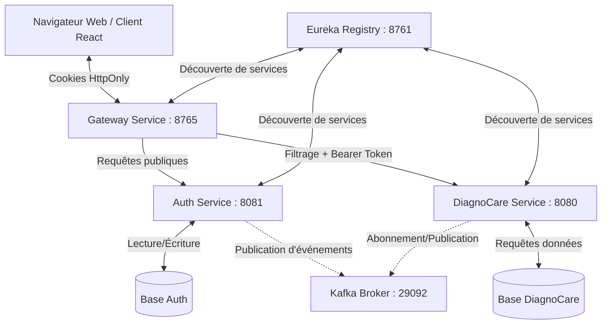

# Diagnocare – Plateforme de Santé Intelligente (Microservices)

Diagnocare est une plateforme de santé basée sur une architecture microservices, construite avec **Spring Boot**, **Apache Kafka** et **PostgreSQL**. Elle intègre l'authentification sécurisée des utilisateurs, l'analyse de symptômes, la prédiction de maladies par apprentissage automatique, ainsi que la gestion des consultations médicales.

---

## Architecture des Microservices



### Services principaux

| Service | Port | Rôle |
| :--- | :--- | :--- |
| `registry-service` | `8761` | Serveur Eureka – enregistrement et découverte dynamique des services |
| `gateway-service` | **`8765`** | Passerelle API – routage, filtrage et gestion de la session |
| `auth-service` | `8081` | Inscription, connexion, codes OTP, conformité RGPD, émission de JWT |
| `diagnocare-service` | `8080` | Logique médicale principale : rendez-vous, symptômes, prédictions |
| `ml-prediction-service` | `5000` | Microservice Python/Flask exposant les prédictions du modèle ML |
| `auth-db` / `diagnocare-db` | `5432` | Conteneurs PostgreSQL dédiés à chaque service |
| `kafka-broker` | `29092` | Broker d'événements pour la synchronisation asynchrone inter-services |
| `kafka-ui` | `8083` | Interface web de supervision des topics et files Kafka |

---

## Authentification & Gestion de Session (Cookies HttpOnly)

Pour prévenir les attaques XSS et maximiser la sécurité, la plateforme **n'expose jamais les tokens JWT au JavaScript côté client**. La session repose exclusivement sur des **cookies HttpOnly, SameSite=Lax**.

### Fonctionnement

1. **Connexion**
   - Lors d'un appel `POST /api/v1/auth/login`, l'`AuthService` génère un token d'accès et un token de rafraîchissement.
   - Ces tokens sont transmis dans les en-têtes `Set-Cookie` de la réponse :
     - `token` – JWT d'accès à courte durée de vie (`HttpOnly`, `Path=/`, `SameSite=Lax`)
     - `refreshToken` – JWT de rafraîchissement à longue durée de vie (`HttpOnly`, `Path=/`, `SameSite=Lax`)

2. **Interception par la passerelle (`AuthFilter`)**
   - Pour les routes privées (ex. `/api/v1/diagnocare/**`), la requête transite par l'`AuthFilter` de la Gateway.
   - Ce filtre extrait le cookie `token`, injecte un en-tête synthétique `Authorization: Bearer <token>`, et valide le token auprès de l'`AuthService` avant de laisser passer la requête.

3. **Filtre interne de l'Auth Service (`JwAuthFilter`)**
   - Les endpoints publics (`/login`, `/register`, `/otp/*`) contournent la validation.
   - Pour les endpoints protégés internes à l'`AuthService`, le filtre `JwAuthFilter` lit d'abord l'en-tête `Authorization`, puis se rabat sur le cookie `token` si l'en-tête est absent.

4. **Rafraîchissement du token**
   - À l'expiration du token d'accès, le client appelle `POST /api/v1/auth/refresh-token`.
   - Le navigateur joint automatiquement le cookie `refreshToken`. L'endpoint le valide et met à jour le cookie `token` à la volée.

5. **Déconnexion**
   - Un appel `POST /api/v1/auth/logout` remet immédiatement la durée de vie des cookies `token` et `refreshToken` à `0`, ce qui ordonne au navigateur de les supprimer.

---

## Configuration CORS

Parce que les credentials (cookies) sont activés, la configuration CORS de la Gateway est strictement restreinte :
- Les origines avec wildcard (`*`) sont interdites.
- Les origines autorisées sont explicitement listées (ex. `http://localhost:5173`).
- `allowCredentials(true)` est activé pour permettre le transfert des cookies.
- L'en-tête `Set-Cookie` est exposé pour que le navigateur puisse sauvegarder les nouvelles clés de session.

---

## Lancement

1. Copier le fichier de configuration depuis le modèle :
   ```bash
   cp .env-exemple .env
   ```
   Puis renseigner les variables (identifiants de bases de données, secrets JWT, etc.).

2. Démarrer tous les services avec Docker Compose :
   ```bash
   docker compose up -d
   ```

3. Suivre les logs d'un service en particulier :
   ```bash
   docker compose logs -f auth-service
   ```

### Accès aux interfaces

| Interface | URL |
| :--- | :--- |
| Eureka Dashboard | http://localhost:8761 |
| Kafka UI | http://localhost:8083 |
| API Gateway | http://localhost:8765 |

---

## Structure du projet

```
diagnocare-microservies-v2/
├── AuthService/            # Service d'authentification (Spring Boot)
├── DiagnoCareService/      # Service médical principal (Spring Boot)
├── GatewayService/         # Passerelle API (Spring Cloud Gateway)
├── RegistryService/        # Registre de services (Eureka)
├── MlPredictionService/    # Service de prédiction ML (Python / Flask)
├── docs/                   # Documentation technique et politique de confidentialité
├── docker-compose.yml      # Orchestration des conteneurs
└── .env-exemple            # Modèle de variables d'environnement
```
