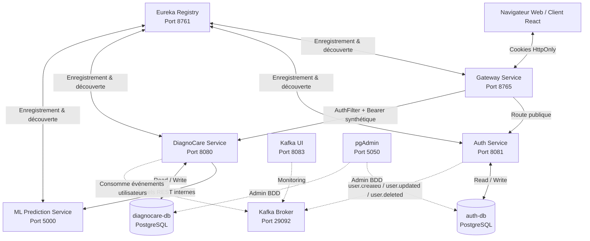

# Diagnocare – Plateforme de Santé Intelligente (Backend Microservices)

Diagnocare est une plateforme de santé connectée construite sur une architecture microservices. Elle permet aux patients de soumettre leurs symptômes en langage naturel, d'obtenir des prédictions de maladies par intelligence artificielle, de suivre leur état de santé dans le temps et de générer des résumés de consultation téléchargeables. Le backend est intégralement conteneurisé et orchestré via Docker Compose.

---

## Table des matières

1. [Architecture](#architecture)
2. [Services](#services)
3. [Authentification & Gestion de Session](#authentification--gestion-de-session)
4. [Synchronisation Kafka](#synchronisation-kafka)
5. [Conformité RGPD](#conformité-rgpd)
6. [Endpoints API](#endpoints-api)
7. [Lancement](#lancement)
8. [Structure du projet](#structure-du-projet)

---

## Architecture



---

## Services

| Service | Port | Technologie | Rôle |
| :--- | :---: | :--- | :--- |
| `registry-service` | `8761` | Spring Boot + Netflix Eureka | Registre de services – enregistrement et découverte dynamique |
| `gateway-service` | **`8765`** | Spring Cloud Gateway | Point d'entrée unique – routage, filtre d'authentification, CORS |
| `auth-service` | `8081` | Spring Boot + Spring Security | Inscription, connexion, OTP, JWT, gestion des utilisateurs |
| `diagnocare-service` | `8080` | Spring Boot + JPA | Logique médicale : prédictions, symptômes, profil, rapports, check-ins |
| `ml-prediction-service` | `5000` | Python + Flask + scikit-learn | Modèle ML : prédiction de maladies, extraction NLP, traduction |
| `auth-db` | `5432` | PostgreSQL 15 | Base de données dédiée à l'AuthService |
| `diagnocare-db` | `5432` | PostgreSQL 15 | Base de données dédiée au DiagnoCareService |
| `kafka-broker` | `29092` | Apache Kafka | Bus d'événements pour la synchronisation asynchrone inter-services |
| `kafka-ui` | `8083` | Kafka UI | Interface web de supervision des topics Kafka |
| `pgadmin` | `5050` | pgAdmin 4 | Interface d'administration des bases PostgreSQL |

### Auth Service

Gère l'ensemble du cycle de vie des utilisateurs et de la sécurité :
- Inscription avec vérification par OTP e-mail
- Connexion avec émission de tokens JWT dans des cookies HttpOnly
- Rafraîchissement de session transparente
- Réinitialisation de mot de passe par OTP
- Changement d'e-mail avec double vérification OTP
- Création de comptes administrateurs / médecins / opérateurs par le Super Admin
- Synchronisation des modifications utilisateur vers les autres services via Kafka
- Chiffrement des données sensibles en base (AES via `EncryptedStringConverter`)

**Rôles gérés :** `PATIENT`, `DOCTOR`, `ADMIN`, `SUPER_ADMIN`

### DiagnoCare Service

Service métier principal de la plateforme :
- Consomme les événements Kafka de l'AuthService pour maintenir un miroir local des utilisateurs
- Orchestre le workflow complet de prédiction (session symptômes → appel ML → stockage)
- Gère le profil médical patient (âge, IMC, tension, cholestérol, antécédents…)
- Planifie les rappels de suivi de santé (check-ins à J+1 et J+2)
- Génère des résumés de consultation exportables en PDF
- Expose les maladies urgentes (alertes rouges)
- Permet aux utilisateurs d'exporter ou d'anonymiser leurs données (RGPD)

### ML Prediction Service

Microservice Python exposant le modèle d'intelligence artificielle :
- Prédit les maladies probables à partir d'une liste de symptômes + données patient (âge, sexe, IMC, tension, cholestérol…)
- Extrait automatiquement les symptômes depuis une description en langage naturel (FR ou EN) via NLP
- Fournit les métadonnées des symptômes et des maladies en français et en anglais
- Traduit des listes de symptômes, maladies et spécialistes
- Enregistré dans Eureka pour la découverte de service
- Documentation interactive disponible via Swagger/Flasgger

---

## Authentification & Gestion de Session

Pour prévenir les attaques XSS, la plateforme **n'expose jamais les tokens JWT au JavaScript côté client**. La session repose sur des **cookies HttpOnly, SameSite=Lax**.

### Flux d'authentification

```
Client                         Gateway                    AuthService
  │                               │                            │
  │── POST /api/v1/auth/login ───►│──────────────────────────►│
  │                               │                            │── Valide identifiants
  │                               │                            │── Génère JWT (access + refresh)
  │◄─── Set-Cookie: token ────────│◄───────────────────────────│
  │◄─── Set-Cookie: refreshToken  │                            │
  │       (HttpOnly, SameSite)     │                            │
```

```
Client                         Gateway                  DiagnoCareService
  │                               │                            │
  │── GET /api/v1/diagnocare/* ──►│                            │
  │    (cookie token joint auto)  │── AuthFilter : extrait     │
  │                               │   cookie → Bearer token    │
  │                               │── POST validate-token ───►AuthService
  │                               │◄─── user details ─────────│
  │                               │── injecte Authorization   │
  │                               │── forward requête ────────►│
  │◄─── réponse ──────────────────│◄───────────────────────────│
```

### Cycle de vie des tokens

| Action | Endpoint | Comportement |
| :--- | :--- | :--- |
| Connexion | `POST /api/v1/auth/login` | Émet `token` + `refreshToken` en cookies HttpOnly |
| Rafraîchissement | `POST /api/v1/auth/refresh-token` | Lit le cookie `refreshToken`, réémet les deux cookies |
| Déconnexion | `POST /api/v1/auth/logout` | Expire les deux cookies à `Max-Age=0` |
| Requête privée | Toute route `/api/v1/diagnocare/**` | L'`AuthFilter` de la Gateway valide le cookie `token` |

### Configuration CORS (Gateway)

- Les origines wildcard (`*`) sont **interdites**
- Origines autorisées explicitement (ex. `http://localhost:5173`)
- `allowCredentials(true)` activé pour le transfert des cookies
- L'en-tête `Set-Cookie` est exposé dans les réponses

---

## Synchronisation Kafka

L'AuthService publie des événements sur Kafka à chaque modification d'utilisateur. Le DiagnoCareService les consomme pour maintenir à jour son miroir local.

| Événement Kafka | Déclencheur | Consommateur |
| :--- | :--- | :--- |
| `user.created` | Inscription d'un nouvel utilisateur | DiagnoCareService – crée l'entrée locale |
| `user.updated` | Mise à jour du profil utilisateur | DiagnoCareService – synchronise les données |
| `user.deleted` | Suppression de compte | DiagnoCareService – supprime les données associées |

---

## Conformité RGPD

La plateforme intègre des mécanismes de conformité RGPD dans les deux services :

- **Chiffrement en base** : les données sensibles (e-mail, nom, etc.) sont chiffrées via des `AttributeConverter` JPA personnalisés (AES)
- **Export des données** : `GET /api/v1/diagnocare/users/{id}/export` génère un fichier JSON complet de toutes les données d'un utilisateur
- **Anonymisation** : le service `UserDataAnonymizationService` permet d'anonymiser les données sans supprimer l'historique médical
- **Suppression** : `DELETE /api/v1/diagnocare/users/{id}` et `DELETE /api/v1/auth/users/{id}` permettent la suppression complète du compte et des données associées
- **Hachage des e-mails** : les e-mails sont hachés pour les recherches, limitant l'exposition des données en clair

---

## Endpoints API

Toutes les routes sont préfixées par `/api/v1/` via la Gateway.  
La documentation Swagger est disponible sur chaque service.

### Auth Service – `/api/v1/auth/`

| Méthode | Route | Description | Auth requise |
| :--- | :--- | :--- | :---: |
| `POST` | `login` | Connexion – émet les cookies JWT | Non |
| `POST` | `register` | Inscription d'un nouveau patient | Non |
| `POST` | `admin-register` | Création d'un compte admin/médecin | SUPER_ADMIN |
| `POST` | `logout` | Déconnexion – expire les cookies | Non |
| `POST` | `refresh-token` | Rafraîchissement de session | Cookie `refreshToken` |
| `POST` | `validate-token` | Validation d'un token Bearer | Non (usage interne) |
| `POST` | `otp/send` | Envoi d'un code OTP par e-mail | Non |
| `POST` | `otp/validate` | Validation du code OTP | Non |
| `POST` | `reset-password` | Réinitialisation du mot de passe via OTP | Non |
| `PUT` | `users/{id}` | Mise à jour du profil utilisateur | Oui |
| `PUT` | `users/{id}/change-password` | Changement de mot de passe (mot de passe actuel requis) | Oui |
| `PUT` | `admin/users/{id}/set-password` | Réinitialisation forcée du mot de passe | SUPER_ADMIN |
| `DELETE` | `users/{id}` | Suppression du compte | Oui |
| `POST` | `users/email/request-change` | Demande de changement d'e-mail (envoi OTP) | Oui |
| `POST` | `users/email/resend-change` | Renvoi de l'OTP de changement d'e-mail | Oui |
| `POST` | `users/email/confirm-change` | Confirmation du changement d'e-mail via OTP | Oui |

### DiagnoCare Service – `/api/v1/diagnocare/`

#### Prédictions
| Méthode | Route | Description |
| :--- | :--- | :--- |
| `POST` | `predictions` | Créer une prédiction IA à partir de symptômes |
| `GET` | `predictions` | Lister toutes les prédictions |
| `GET` | `predictions/{id}` | Obtenir une prédiction par ID |
| `GET` | `predictions/user/{userId}` | Prédictions d'un utilisateur |
| `GET` | `predictions/red-alerts` | Prédictions marquées comme alertes rouges |
| `PUT` | `predictions/{id}` | Modifier une prédiction |
| `DELETE` | `predictions/{id}` | Supprimer une prédiction |
| `DELETE` | `predictions/user/{userId}` | Supprimer toutes les prédictions d'un utilisateur |

#### Résumés de consultation
| Méthode | Route | Description |
| :--- | :--- | :--- |
| `GET` | `consultation-summaries/{predictionId}` | Données du résumé de consultation |
| `GET` | `consultation-summaries/{predictionId}/pdf` | Télécharger le résumé en PDF |

#### Check-ins (suivi de santé)
| Méthode | Route | Description |
| :--- | :--- | :--- |
| `POST` | `check-ins/activate` | Activer le suivi de santé pour une prédiction |
| `POST` | `check-ins` | Soumettre un check-in et créer une prédiction de suivi |
| `GET` | `check-ins?userId=` | Lister les check-ins d'un utilisateur |

#### Symptômes
| Méthode | Route | Description |
| :--- | :--- | :--- |
| `GET` | `symptoms` | Lister tous les symptômes |
| `GET` | `symptoms/{id}` | Obtenir un symptôme par ID |
| `GET` | `symptoms/search?label=` | Rechercher des symptômes par libellé |
| `GET` | `symptoms/ml-metadata` | Métadonnées des symptômes ML (FR/EN) |
| `DELETE` | `symptoms/{id}` | Supprimer un symptôme |

#### Profil médical patient
| Méthode | Route | Description |
| :--- | :--- | :--- |
| `POST` | `patient-profiles` | Créer ou mettre à jour un profil médical |
| `PUT` | `patient-profiles` | Mettre à jour un profil médical |
| `GET` | `patient-profiles/user/{userId}` | Obtenir le profil médical d'un utilisateur |
| `DELETE` | `patient-profiles/{id}` | Supprimer un profil médical |

#### Médecins / Spécialistes
| Méthode | Route | Description |
| :--- | :--- | :--- |
| `GET` | `doctors` | Lister tous les spécialistes (créés automatiquement par le ML) |
| `GET` | `doctors/{id}` | Obtenir un spécialiste par ID |
| `GET` | `doctors/search?specialty=` | Rechercher des spécialistes par spécialité |

#### Rapports
| Méthode | Route | Description |
| :--- | :--- | :--- |
| `POST` | `reports` | Créer un rapport / signalement utilisateur |
| `GET` | `reports/{id}` | Obtenir un rapport par ID |
| `GET` | `reports/user/{userId}` | Rapports d'un utilisateur |
| `GET` | `reports/uncorrected` | Rapports en attente de traitement |
| `PUT` | `reports/{id}/mark-corrected` | Marquer un rapport comme traité |
| `PUT` | `reports/{id}` | Modifier un rapport |
| `DELETE` | `reports/{id}` | Supprimer un rapport |

#### Maladies urgentes
| Méthode | Route | Description |
| :--- | :--- | :--- |
| `GET` | `urgent-diseases` | Lister les maladies urgentes |
| `POST` | `urgent-diseases` | Ajouter une maladie urgente |
| `DELETE` | `urgent-diseases/{id}` | Supprimer une maladie urgente |

#### Paramètres applicatifs
| Méthode | Route | Description |
| :--- | :--- | :--- |
| `GET` | `settings` | Lister tous les paramètres |
| `GET` | `settings/known` | Lister les clés de paramètres supportées |
| `GET` | `settings/{key}` | Obtenir la valeur d'un paramètre |
| `PUT` | `settings/{key}` | Modifier la valeur d'un paramètre |

#### Utilisateurs (RGPD)
| Méthode | Route | Description |
| :--- | :--- | :--- |
| `GET` | `users/{id}` | Obtenir un utilisateur par ID |
| `GET` | `users` | Lister tous les utilisateurs |
| `GET` | `users/{id}/export` | Exporter toutes les données d'un utilisateur (JSON) |
| `PUT` | `users/{id}` | Mettre à jour un utilisateur |
| `DELETE` | `users/{id}` | Supprimer un utilisateur |

### ML Prediction Service – `http://localhost:5000/`

| Méthode | Route | Description |
| :--- | :--- | :--- |
| `GET` | `/health` | Vérification de l'état du service |
| `GET` | `/features-metadata` | Liste des symptômes avec traductions FR/EN |
| `GET` | `/diseases-metadata` | Liste des maladies avec traductions FR/EN |
| `POST` | `/extract-symptoms` | Extraction NLP de symptômes depuis un texte libre |
| `POST` | `/predict` | Prédiction de maladies et spécialistes recommandés |
| `POST` | `/translate` | Traduction de symptômes, maladies et spécialistes |
| `GET` | `/apidocs` | Documentation Swagger interactive |

**Paramètres d'entrée de `/predict` :** `symptoms[]`, `language`, `age`, `weight`, `bmi`, `tension_moyenne`, `cholesterole_moyen`, `gender`, `blood_pressure`, `cholesterol_level`, `smoking`, `alcohol`, `sedentarite`, `family_history`

---

## Lancement

### Prérequis

- Docker Desktop (Windows / macOS) ou Docker Engine + Docker Compose (Linux)
- Git

### Démarrage rapide

1. **Cloner le dépôt et configurer les variables d'environnement :**
   ```bash
   cp .env-exemple .env
   # Éditer .env : identifiants BDD, secrets JWT, configuration e-mail, etc.
   ```

2. **Entraîner le modèle ML** (si les fichiers `.joblib` ne sont pas déjà présents) :
   ```bash
   cd MlPredictionService
   python train.py
   cd ..
   ```

3. **Démarrer tous les services :**
   ```bash
   docker compose up -d
   ```

4. **Vérifier que tous les conteneurs sont démarrés :**
   ```bash
   docker compose ps
   ```

5. **Suivre les logs d'un service :**
   ```bash
   docker compose logs -f auth-service
   docker compose logs -f diagnocare-service
   docker compose logs -f ml-prediction-service
   ```

6. **Arrêter tous les services :**
   ```bash
   docker compose down
   ```

### Interfaces disponibles après démarrage

| Interface | URL | Description |
| :--- | :--- | :--- |
| Eureka Dashboard | http://localhost:8761 | Vue d'ensemble des services enregistrés |
| API Gateway | http://localhost:8765 | Point d'entrée des requêtes clients |
| Kafka UI | http://localhost:8083 | Monitoring des topics Kafka |
| pgAdmin | http://localhost:5050 | Administration des bases PostgreSQL |
| ML Swagger UI | http://localhost:5000/apidocs | Documentation interactive du service ML |

### Variables d'environnement clés (`.env`)

| Variable | Description |
| :--- | :--- |
| `AUTH_DB_USERNAME` / `AUTH_DB_PASSWORD` | Identifiants de la base auth |
| `DB_USERNAME` / `DB_PASSWORD` | Identifiants de la base diagnocare |
| `JWT_SECRET` | Clé secrète pour la signature des tokens JWT |
| `JWT_EXPIRATION` | Durée de vie du token d'accès (ms) |
| `JWT_REFRESH_EXPIRATION` | Durée de vie du token de rafraîchissement (ms) |
| `MAIL_HOST` / `MAIL_PORT` / `MAIL_USERNAME` / `MAIL_PASSWORD` | Configuration SMTP pour les e-mails OTP |
| `ENCRYPTION_KEY` | Clé AES pour le chiffrement des données sensibles en BDD |

---

## Structure du projet

```
diagnocare-microservies-v2/
│
├── AuthService/                    # Service d'authentification (Spring Boot)
│   └── src/main/java/com/homosapiens/authservice/
│       ├── controller/             # AuthController, RoleController
│       ├── model/                  # Entités JPA : User, Otp, Role
│       ├── service/                # AuthService, OtpService
│       ├── security/               # JwAuthFilter, JWTAuthProvider, SecurityConfig
│       └── core/                   # Kafka, exceptions, chiffrement
│
├── DiagnoCareService/              # Service médical principal (Spring Boot)
│   └── src/main/java/com/homosapiens/diagnocareservice/
│       ├── controller/             # 13 contrôleurs REST
│       ├── model/entity/           # Entités JPA : Prediction, Symptom, CheckIn, Report…
│       ├── service/                # Services métier + implémentations
│       ├── repository/             # Repositories Spring Data JPA
│       ├── dto/                    # Objets de transfert de données
│       └── core/                   # Kafka consumer, chiffrement, sécurité
│
├── GatewayService/                 # Passerelle API (Spring Cloud Gateway)
│   └── src/main/resources/
│       └── application.properties  # Routes, filtre AuthFilter, CORS
│
├── RegistryService/                # Registre Eureka (Spring Boot)
│
├── MlPredictionService/            # Service ML (Python / Flask)
│   ├── app.py                      # Factory Flask, routes
│   ├── controllers/                # health, metadata, prediction
│   ├── services/                   # PredictionService, NLPService, TranslationService
│   ├── models/                     # Wrappers des modèles .joblib
│   ├── repositories/               # ModelRepository, TranslationRepository
│   ├── training/                   # Scripts d'entraînement (train.py)
│   └── config/                     # AppConfig, ModelConfig
│
├── docs/                           # Documentation technique et légale
│   ├── technical-documentation/    # Architecture, schéma BDD, flux Kafka…
│   └── privacy-policy.md / terms-of-service.md
│
├── docker-compose.yml              # Orchestration complète de tous les services
└── .env-exemple                    # Modèle de configuration
```
