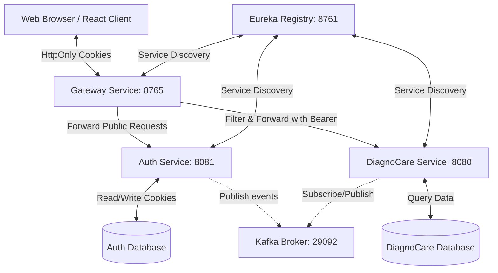

# 🏥 Diagnocare – Intelligent Healthcare Microservices Platform

Diagnocare is a microservices-based healthcare platform built with **Spring Boot**, **Apache Kafka**, and **PostgreSQL**. It includes user authentication, symptom analysis, disease prediction, online consultations, and more.

---

## 🧭 Microservices Architecture



### Core Services:

| Service Name | Port | Description |
| :--- | :--- | :--- |
| `registry-service` | `8761` | Eureka Server for dynamic service registration and discovery |
| `gateway-service` | **`8765`** | API Gateway (routes all public requests, intercepts auth state) |
| `auth-service` | `8081` | Handles registrations, logins, verification codes, GDPR, and JWT issuance |
| `diagnocare-service` | `8080` | Core medical logic, appointments, symptom mapping, and prediction |
| `ml-prediction-service` | `5000` | Python Flask microservice exposing machine learning model predictions |
| `auth-db` / `diagnocare-db` | `5432` | Dedicated PostgreSQL database containers |
| `kafka-broker` | `29092` | Event broker for asynchronous inter-service synchronization |
| `kafka-ui` | `8083` | Web dashboard for monitoring Kafka topics and queues |

---

## 🔐 Authentication & Session System (HttpOnly Cookies)

To prevent Cross-Site Scripting (XSS) and maximize security, the platform does **not** expose JWT tokens to client-side JavaScript. Instead, it uses **HttpOnly, SameSite=Lax cookies**.

### How it works:

1. **Authentication:**
   * When a user logs in via `POST /api/v1/auth/login`, `AuthService` issues an access token and a refresh token.
   * Instead of returning them in the response body, `AuthService` sends them back in `Set-Cookie` headers:
     * `token` (Short-lived JWT access token, `HttpOnly`, `Path=/`, `SameSite=Lax`)
     * `refreshToken` (Long-lived JWT refresh token, `HttpOnly`, `Path=/`, `SameSite=Lax`)

2. **API Gateway Interception (`AuthFilter`):**
   * For private microservices (e.g., `/api/v1/diagnocare/**`), requests go through the Gateway's `AuthFilter`.
   * The `AuthFilter` extracts the `token` cookie, mutates the incoming request to inject a synthetic `Authorization: Bearer <token>` header, and validates it against `AuthService` before letting the request proceed downstream.

3. **Auth-Service Fallback (`JwAuthFilter`):**
   * Public endpoints (`/login`, `/register`, `/otp/*`) bypass token validation.
   * For protected endpoints directly inside `AuthService` (e.g., editing user details), the service's internal `JwAuthFilter` checks the `Authorization` header first, falling back to reading the `token` cookie if the header is missing.

4. **Token Refreshing:**
   * When the access token expires, the client calls `POST /api/v1/auth/refresh-token`.
   * The browser automatically attaches the `refreshToken` cookie. The endpoint validates it and updates the access token `token` cookie on the fly.

5. **Logout:**
   * Calling `POST /api/v1/auth/logout` immediately resets the expiration time of both the `token` and `refreshToken` cookies to `0`, prompting the browser to destroy them.

---

## 🌐 CORS Configuration

Because credentials (cookies) are enabled, the Gateway's `CorsConfig` is strictly configured:
* Wildcard origins (`*`) are disallowed.
* Origins are locked down to specific frontend locations (e.g. `http://localhost:5173`).
* `allowCredentials(true)` is explicitly enabled to allow cookie transfers.
* `Set-Cookie` is exposed to allow the browser to save updated session keys.

---

## ⚙️ How to Run

1. Create a `.env` file from the template `.env-exemple`.
2. Spin up all infrastructure and code services using Docker Compose:
   ```bash
   docker compose up -d
   ```
3. Monitor logs for individual containers:
   ```bash
   docker compose logs -f auth-service
   ```
