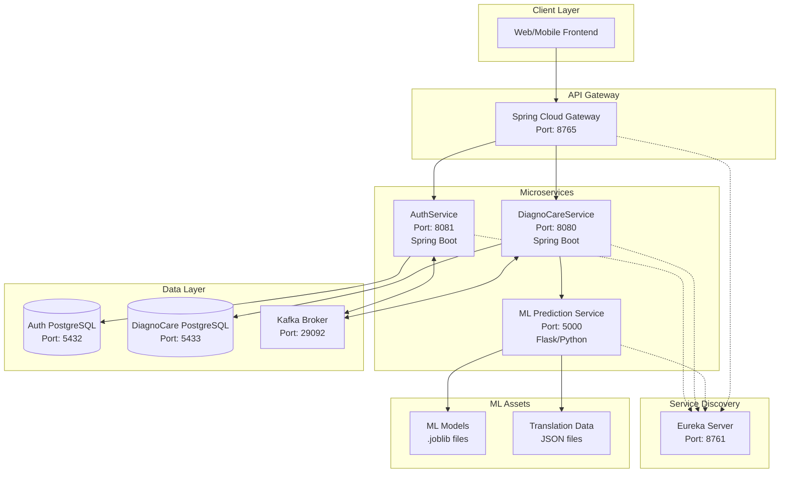
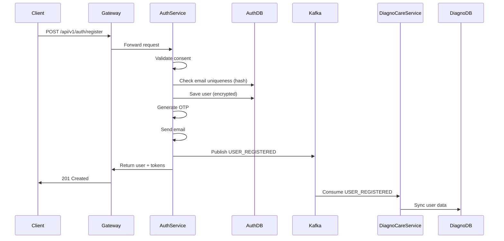
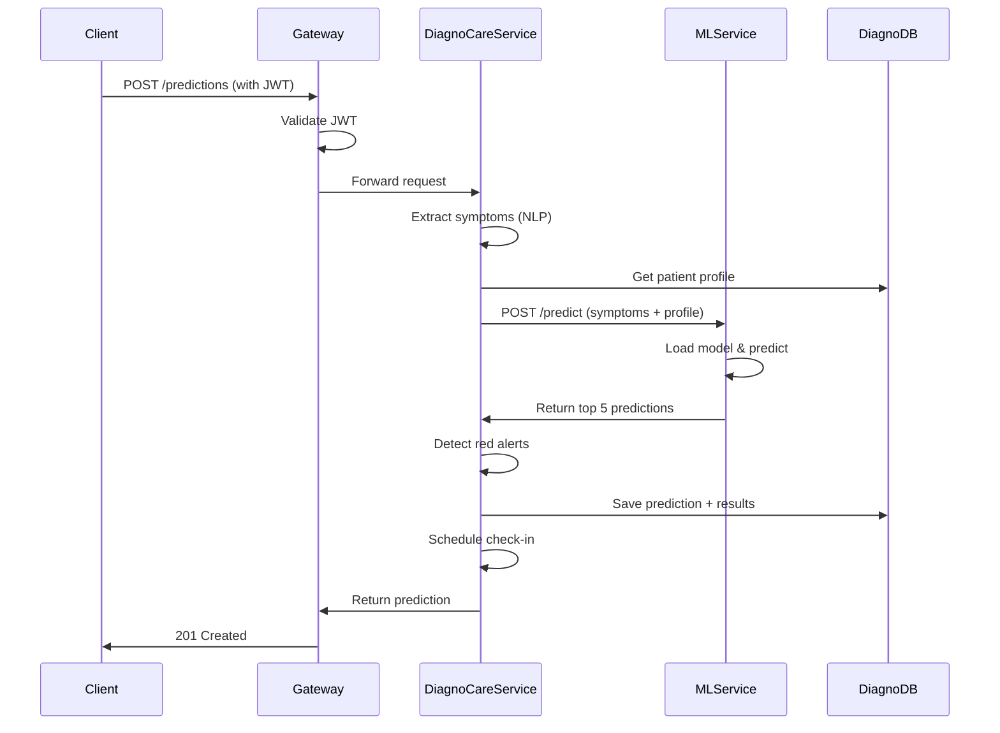

# DiagnoCare - Architecture Overview

## Table of Contents
1. [System Overview](#system-overview)
2. [Microservices Architecture](#microservices-architecture)
3. [Technology Stack](#technology-stack)
4. [Communication Patterns](#communication-patterns)
5. [Data Flow](#data-flow)
6. [Infrastructure Components](#infrastructure-components)

---

## System Overview

**DiagnoCare** is a comprehensive healthcare microservices platform that provides:
- Intelligent disease prediction based on symptoms using Machine Learning
- User authentication and authorization with JWT
- Health data management and tracking
- Follow-up check-ins and reminders
- Medical reports and consultations
- GDPR-compliant data handling

### Core Principles
- **Microservices Architecture**: Loosely coupled, independently deployable services
- **Event-Driven Communication**: Asynchronous messaging via Apache Kafka
- **Service Discovery**: Eureka for dynamic service registration
- **API Gateway**: Single entry point for all client requests
- **Security First**: Encryption at rest, JWT authentication, GDPR compliance

---

## Microservices Architecture

### Service Diagram

---

## Services Breakdown

### 1. Registry Service (Eureka Server)
- **Purpose**: Service discovery and registration
- **Port**: 8761
- **Technology**: Spring Cloud Netflix Eureka
- **Responsibilities**:
  - Register all microservices
  - Provide service lookup
  - Health monitoring
  - Load balancing information

### 2. Gateway Service (Spring Cloud Gateway)
- **Purpose**: API Gateway - single entry point
- **Port**: 8765
- **Technology**: Spring Cloud Gateway
- **Responsibilities**:
  - Route requests to appropriate services
  - JWT token validation
  - Request/response transformation
  - Rate limiting (future)
  - CORS handling
- **Routes**:
  - `/api/v1/auth/**` → AuthService
  - `/api/v1/diagnocare/**` → DiagnoCareService (with auth filter)

### 3. Auth Service
- **Purpose**: Authentication and user management
- **Port**: 8081
- **Context Path**: `/api/v1/auth`
- **Technology**: Spring Boot 3.x, Spring Security, JWT
- **Database**: PostgreSQL (auth_db)
- **Key Features**:
  - User registration with GDPR consent
  - JWT token generation (access + refresh)
  - Email verification via OTP
  - Password encryption (BCrypt)
  - Data encryption at rest (AES-256-GCM)
  - User synchronization via Kafka

### 4. DiagnoCare Service
- **Purpose**: Core business logic - predictions, health data
- **Port**: 8080
- **Context Path**: `/api/v1/diagnocare`
- **Technology**: Spring Boot 3.x, JPA/Hibernate
- **Database**: PostgreSQL (diagnocare_db)
- **Key Features**:
  - Symptom management
  - ML-based disease prediction
  - Check-in scheduling and reminders
  - Medical reports
  - Patient medical profiles
  - GDPR data export and anonymization
  - User synchronization from AuthService

### 5. ML Prediction Service
- **Purpose**: Machine Learning predictions
- **Port**: 5000
- **Technology**: Flask (Python), scikit-learn
- **Key Features**:
  - Disease prediction from symptoms
  - Specialist recommendation
  - Symptom extraction from natural language
  - Multi-language support (FR/EN)
  - Model loading and inference

---

## Technology Stack

### Backend Services
- **Java 17**: Programming language
- **Spring Boot 3.3.9**: Framework
- **Spring Cloud**: Microservices tools
  - Spring Cloud Gateway: API Gateway
  - Spring Cloud Netflix Eureka: Service discovery
- **Spring Security**: Authentication & authorization
- **Spring Data JPA**: Database access
- **Hibernate**: ORM
- **PostgreSQL 15**: Relational database
- **Apache Kafka**: Message broker (KRaft mode)
- **Maven**: Build tool

### ML Service
- **Python 3.x**: Programming language
- **Flask**: Web framework
- **scikit-learn**: Machine Learning library
- **pandas/numpy**: Data processing

### Infrastructure
- **Docker**: Containerization
- **Docker Compose**: Orchestration
- **PostgreSQL**: Database
- **Kafka UI**: Monitoring tool
- **pgAdmin4**: Database management

---

## Communication Patterns

### 1. Synchronous Communication (HTTP/REST)
- **Client → Gateway → Services**: REST API calls
- **DiagnoCare → ML Service**: HTTP requests for predictions
- **Gateway → AuthService**: Token validation

### 2. Asynchronous Communication (Kafka)
- **Topics**:
  - `USER_REGISTERED`: New user registration
  - `USER_UPDATE`: User profile update
  - `USER_DELETED`: User account deletion
- **Producers**: AuthService
- **Consumers**: DiagnoCareService (UserSyncConsumer)

### 3. Service Discovery (Eureka)
- All services register with Eureka
- Gateway uses Eureka for service lookup
- Load balancing via Eureka

---

## Data Flow

### User Registration Flow

### Prediction Flow

---

## Infrastructure Components

### Databases

#### Auth Database (auth_db)
- **Purpose**: User authentication data
- **Tables**: users, roles, user_roles, otps
- **Encryption**: Email, phone number encrypted at rest
- **Connection**: Port 5432 (internal)

#### DiagnoCare Database (diagnocare_db)
- **Purpose**: Health data and business logic
- **Tables**: users, symptoms, predictions, check_ins, reports, patient_medical_profiles, etc.
- **Encryption**: Email, address, phone, medical data encrypted
- **Connection**: Port 5433 (internal)

### Message Broker

#### Apache Kafka
- **Mode**: KRaft (no Zookeeper)
- **Port**: 29092 (external), 9092 (internal)
- **Topics**: USER_REGISTERED, USER_UPDATE, USER_DELETED
- **UI**: Kafka UI on port 8083

### Monitoring Tools

#### pgAdmin4
- **Port**: 8888
- **Purpose**: PostgreSQL database management UI

#### Kafka UI
- **Port**: 8083
- **Purpose**: Kafka topic monitoring and management

---

## Security Architecture

### Authentication Flow
1. User logs in → AuthService validates credentials
2. AuthService generates JWT access token (1 hour) + refresh token (7 days)
3. Client stores tokens
4. Subsequent requests include `Authorization: Bearer <token>`
5. Gateway validates token with AuthService
6. Request forwarded to target service

### Data Encryption
- **At Rest**: AES-256-GCM encryption for sensitive fields
- **In Transit**: HTTPS (configured in production)
- **Passwords**: BCrypt hashing
- **Email Uniqueness**: SHA-256 hash for uniqueness checks

### GDPR Compliance
- **Consent Management**: Required for registration
- **Data Encryption**: All PII encrypted
- **Data Export**: Users can export all their data
- **Anonymization**: PII removed on account deletion, health data preserved

---

## Deployment Architecture

### Docker Compose Services
1. **auth-postgres**: PostgreSQL for AuthService
2. **diagnocare-postgres**: PostgreSQL for DiagnoCareService
3. **pgadmin**: Database management UI
4. **registry-service**: Eureka server
5. **auth-service**: Authentication service
6. **diagnocare-service**: Main business service
7. **gateway-service**: API Gateway
8. **kafka**: Kafka broker (KRaft)
9. **kafka-ui**: Kafka monitoring
10. **ml-prediction-service**: ML prediction service

### Network Architecture
- All services in same Docker network
- Internal communication via service names
- External access only through Gateway (port 8765)
- Database ports exposed for development only

---

## Scalability Considerations

### Horizontal Scaling
- **Stateless Services**: All services are stateless (except databases)
- **Load Balancing**: Eureka provides service instances for load balancing
- **Database**: Can be scaled with read replicas

### Performance Optimizations
- **Connection Pooling**: HikariCP for database connections
- **Lazy Loading**: JPA lazy fetching for relationships
- **Caching**: Can be added for frequently accessed data
- **Async Processing**: Kafka for non-critical operations

---

## Next Steps

See detailed documentation:
- [Database Schema](02-database-schema.md)
- [Auth Service](03-auth-service.md)
- [DiagnoCare Service](04-diagnocare-service.md)
- [Gateway Service](05-gateway-service.md)
- [ML Prediction Service](06-ml-prediction-service.md)
- [API Endpoints](07-api-endpoints.md)
- [Workflows](08-workflows.md)
