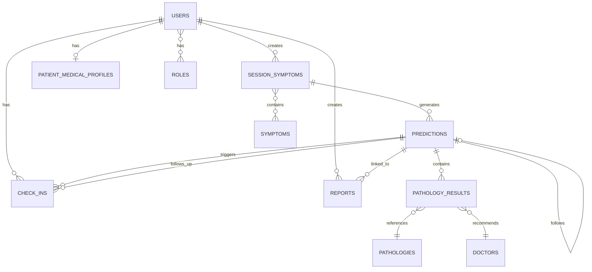

# DiagnoCare - Database Schema Documentation

## Table of Contents
1. [Overview](#overview)
2. [Auth Database Schema](#auth-database-schema)
3. [DiagnoCare Database Schema](#diagnocare-database-schema)
4. [Entity Relationships](#entity-relationships)
5. [Encryption & Security](#encryption--security)
6. [Indexes & Constraints](#indexes--constraints)

---

## Overview

DiagnoCare uses **two separate PostgreSQL databases**:
1. **auth_db**: Authentication and user management (AuthService)
2. **diagnocare_db**: Health data and business logic (DiagnoCareService)

This separation provides:
- **Security**: Isolated authentication data
- **Scalability**: Independent scaling
- **Maintenance**: Easier backup and recovery

---

## Auth Database Schema

**Database Name**: `auth_db`  
**Service**: AuthService  
**Port**: 5432

### Tables

#### 1. `users`
**Purpose**: User accounts and authentication data

| Column | Type | Constraints | Description |
|--------|------|-------------|-------------|
| `id` | BIGINT | PRIMARY KEY, AUTO_INCREMENT | User ID |
| `email` | VARCHAR(255) | UNIQUE, **ENCRYPTED** | User email (encrypted at rest) |
| `email_hash` | VARCHAR(64) | UNIQUE, NOT NULL | SHA-256 hash for uniqueness checks |
| `first_name` | VARCHAR(50) | NOT NULL | First name |
| `last_name` | VARCHAR(50) | NOT NULL | Last name |
| `phone_number` | VARCHAR(15) | **ENCRYPTED** | Phone number (encrypted) |
| `password` | VARCHAR(255) | NOT NULL | BCrypt hashed password |
| `lang` | VARCHAR(5) | DEFAULT 'fr' | Language preference (fr/en) |
| `email_verified` | BOOLEAN | NOT NULL, DEFAULT false | Email verification status |
| `privacy_policy_accepted` | BOOLEAN | NOT NULL, DEFAULT false | GDPR consent |
| `terms_accepted` | BOOLEAN | NOT NULL, DEFAULT false | Terms acceptance |
| `consent_date` | TIMESTAMP | | Date of consent |
| `consent_version` | VARCHAR(50) | | Consent version (e.g., "v1.0-2024") |
| `created_at` | TIMESTAMP | NOT NULL | Creation timestamp |
| `updated_at` | TIMESTAMP | | Last update timestamp |

**Encryption**: `email` and `phone_number` are encrypted using AES-256-GCM via JPA AttributeConverter.

**Indexes**:
- PRIMARY KEY: `id`
- UNIQUE: `email` (on encrypted value)
- UNIQUE: `email_hash` (for uniqueness checks)

#### 2. `roles`
**Purpose**: User roles/permissions

| Column | Type | Constraints | Description |
|--------|------|-------------|-------------|
| `id` | INTEGER | PRIMARY KEY | Role ID |
| `name` | VARCHAR(255) | UNIQUE, NOT NULL | Role name (PATIENT, ADMIN, DOCTOR, OPERATOR, SUPER_ADMIN) |
| `description` | VARCHAR(255) | | Role description |
| `created_at` | TIMESTAMP | | Creation timestamp |
| `updated_at` | TIMESTAMP | | Last update timestamp |

**Enum Values**: PATIENT, ADMIN, DOCTOR, OPERATOR, SUPER_ADMIN

#### 3. `user_roles`
**Purpose**: Many-to-many relationship between users and roles

| Column | Type | Constraints | Description |
|--------|------|-------------|-------------|
| `user_id` | BIGINT | FOREIGN KEY → users.id | User ID |
| `role_id` | INTEGER | FOREIGN KEY → roles.id | Role ID |

**Primary Key**: Composite (`user_id`, `role_id`)

#### 4. `otps`
**Purpose**: One-time passwords for email verification

| Column | Type | Constraints | Description |
|--------|------|-------------|-------------|
| `id` | BIGINT | PRIMARY KEY | OTP ID |
| `email` | VARCHAR(255) | NOT NULL | Email address |
| `code` | VARCHAR(6) | NOT NULL | 6-digit OTP code |
| `expires_at` | TIMESTAMP | NOT NULL | Expiration time |
| `used` | BOOLEAN | DEFAULT false | Whether OTP was used |
| `created_at` | TIMESTAMP | | Creation timestamp |

**TTL**: 10 minutes (configurable)

---

## DiagnoCare Database Schema

**Database Name**: `diagnocare_db`  
**Service**: DiagnoCareService  
**Port**: 5433

### Core Entities

#### 1. `users`
**Purpose**: User profile in DiagnoCare (synced from AuthService)

| Column | Type | Constraints | Description |
|--------|------|-------------|-------------|
| `id` | BIGINT | PRIMARY KEY | User ID (synced from AuthService) |
| `first_name` | VARCHAR(100) | | First name |
| `last_name` | VARCHAR(100) | | Last name |
| `email` | VARCHAR(255) | UNIQUE, **ENCRYPTED** | Email (encrypted) |
| `address` | VARCHAR(255) | **ENCRYPTED** | Address (encrypted) |
| `phone_number` | VARCHAR(13) | **ENCRYPTED** | Phone (encrypted) |
| `birth_date` | DATE | | Date of birth |
| `gender` | BOOLEAN | | Gender (true=male, false=female) |
| `lang` | VARCHAR(5) | DEFAULT 'fr' | Language preference |
| `is_active` | BOOLEAN | | Account active status |
| `clinic_id` | BIGINT | FK → clinics.id | Associated clinic (for doctors) |
| `specialization_id` | BIGINT | FK → specializations.id | Medical specialization |
| `npi` | VARCHAR(11) | | National Provider Identifier |
| `health_assurance_number` | VARCHAR(13) | | Health insurance number |
| `credit` | VARCHAR(50) | | Credit/balance |
| `stripe_customer_id` | VARCHAR(255) | | Stripe customer ID |
| `created_date` | TIMESTAMP | | Creation timestamp (from BaseEntity) |
| `updated_date` | TIMESTAMP | | Last update timestamp |

**Encryption**: `email`, `address`, `phone_number` encrypted at rest.

**Relationships**:
- One-to-Many: `session_symptom` (symptom sessions)
- Many-to-Many: `roles` (via `user_roles`)
- One-to-One: `patient_medical_profiles`

#### 2. `roles`
**Purpose**: User roles (PATIENT, ADMIN only in DiagnoCare)

| Column | Type | Constraints | Description |
|--------|------|-------------|-------------|
| `id` | INTEGER | PRIMARY KEY | Role ID |
| `name` | VARCHAR(255) | UNIQUE, NOT NULL | Role name (PATIENT, ADMIN) |
| `description` | VARCHAR(255) | | Role description |
| `created_at` | TIMESTAMP | | Creation timestamp |
| `updated_at` | TIMESTAMP | | Last update timestamp |

#### 3. `symptomes` (symptoms)
**Purpose**: Medical symptoms catalog

| Column | Type | Constraints | Description |
|--------|------|-------------|-------------|
| `id` | BIGINT | PRIMARY KEY | Symptom ID |
| `label` | VARCHAR(500) | | Symptom label/name |
| `symptom_label_id` | BIGINT | | Symptom label identifier |
| `created_date` | TIMESTAMP | | Creation timestamp |
| `updated_date` | TIMESTAMP | | Last update timestamp |

#### 4. `symptome_session` (session_symptoms)
**Purpose**: User symptom sessions (one prediction session)

| Column | Type | Constraints | Description |
|--------|------|-------------|-------------|
| `id` | BIGINT | PRIMARY KEY | Session ID |
| `user_id` | BIGINT | FK → users.id, NOT NULL | User who created session |
| `raw_description` | TEXT | | Natural language symptom description |
| `created_date` | TIMESTAMP | | Creation timestamp |
| `updated_date` | TIMESTAMP | | Last update timestamp |

**Relationships**:
- Many-to-One: `user`
- Many-to-Many: `symptomes` (via `symptome_session_symptome`)
- One-to-Many: `predictions`

#### 5. `predictions`
**Purpose**: ML prediction results

| Column | Type | Constraints | Description |
|--------|------|-------------|-------------|
| `id` | BIGINT | PRIMARY KEY | Prediction ID |
| `id_symptome` | BIGINT | FK → symptome_session.id, NOT NULL | Session symptom ID |
| `pre_id_prediction` | BIGINT | FK → predictions.id | Previous prediction (for follow-ups) |
| `global_score` | DECIMAL(10,2) | | Best prediction score (0-100) |
| `is_red_alert` | BOOLEAN | DEFAULT false | Critical condition flag |
| `comment` | TEXT | | Prediction comment |
| `pdf_report_url` | VARCHAR(500) | | PDF report URL |
| `created_date` | TIMESTAMP | | Creation timestamp |
| `updated_date` | TIMESTAMP | | Last update timestamp |

**Relationships**:
- Many-to-One: `sessionSymptom`
- Many-to-One: `previousPrediction` (self-referential for follow-ups)
- One-to-Many: `pathologyResults`
- One-to-Many: `reports`
- One-to-Many: `checkIns`

#### 6. `resultat_pathologie` (pathology_results)
**Purpose**: Individual disease predictions within a prediction

| Column | Type | Constraints | Description |
|--------|------|-------------|-------------|
| `id` | BIGINT | PRIMARY KEY | Pathology result ID |
| `id_prediction` | BIGINT | FK → predictions.id, NOT NULL | Parent prediction |
| `pathologie_id` | BIGINT | FK → pathologies.id, NOT NULL | Disease/pathology |
| `medecin_id` | BIGINT | FK → medecins.id, NOT NULL | Recommended doctor |
| `disease_score` | DECIMAL(10,2) | | Disease probability (0-100) |
| `localized_disease_name` | VARCHAR(255) | | Disease name (localized) |
| `localized_specialist_label` | VARCHAR(255) | | Specialist label (localized) |
| `description` | TEXT | | Result description |
| `created_date` | TIMESTAMP | | Creation timestamp |
| `updated_date` | TIMESTAMP | | Last update timestamp |

**Note**: Typically stores top 3 predictions from ML service.

#### 7. `pathologies`
**Purpose**: Disease/pathology catalog

| Column | Type | Constraints | Description |
|--------|------|-------------|-------------|
| `id` | BIGINT | PRIMARY KEY | Pathology ID |
| `pathology_name` | VARCHAR(255) | NOT NULL | Disease name |
| `description` | TEXT | | Disease description |
| `created_date` | TIMESTAMP | | Creation timestamp |
| `updated_date` | TIMESTAMP | | Last update timestamp |

#### 8. `medecins` (doctors)
**Purpose**: Doctor/specialist catalog

| Column | Type | Constraints | Description |
|--------|------|-------------|-------------|
| `id` | BIGINT | PRIMARY KEY | Doctor ID |
| `specialist_label` | VARCHAR(255) | NOT NULL | Specialist type (e.g., "Dermatologist") |
| `specialist_score` | DECIMAL(10,2) | | Specialist recommendation score |
| `description` | TEXT | | Doctor description |
| `created_date` | TIMESTAMP | | Creation timestamp |
| `updated_date` | TIMESTAMP | | Last update timestamp |

#### 9. `check_ins`
**Purpose**: Follow-up check-in reminders

| Column | Type | Constraints | Description |
|--------|------|-------------|-------------|
| `id` | BIGINT | PRIMARY KEY | Check-in ID |
| `user_id` | BIGINT | FK → users.id, NOT NULL | User ID |
| `previous_prediction_id` | BIGINT | FK → predictions.id, NOT NULL | Original prediction |
| `status` | VARCHAR(20) | DEFAULT 'PENDING' | Status (PENDING, SENT_24H, SENT_48H, COMPLETED) |
| `outcome` | VARCHAR(20) | | Outcome (IMPROVED, SAME, WORSE) |
| `worse_reason` | TEXT | | Reason if worse |
| `first_reminder_at` | TIMESTAMP | | First reminder time (24h) |
| `second_reminder_at` | TIMESTAMP | | Second reminder time (48h) |
| `first_sent_at` | TIMESTAMP | | When first reminder was sent |
| `second_sent_at` | TIMESTAMP | | When second reminder was sent |
| `completed_at` | TIMESTAMP | | When check-in was completed |
| `created_date` | TIMESTAMP | | Creation timestamp |
| `updated_date` | TIMESTAMP | | Last update timestamp |

**Reminder Schedule**:
- First reminder: 24 hours after prediction (1440 minutes)
- Second reminder: 48 hours after prediction (2880 minutes)

#### 10. `signalements` (reports)
**Purpose**: Medical reports

| Column | Type | Constraints | Description |
|--------|------|-------------|-------------|
| `id` | BIGINT | PRIMARY KEY | Report ID |
| `user_id` | BIGINT | FK → users.id, NOT NULL | User/patient ID |
| `id_prediction` | BIGINT | FK → predictions.id | Associated prediction |
| `title` | VARCHAR(200) | | Report title |
| `comment` | TEXT | | Report comment |
| `report_date` | TIMESTAMP | | Report date |
| `is_corrected` | BOOLEAN | DEFAULT false | Correction status |
| `created_date` | TIMESTAMP | | Creation timestamp |
| `updated_date` | TIMESTAMP | | Last update timestamp |

#### 11. `patient_medical_profiles`
**Purpose**: Patient medical history and profile

| Column | Type | Constraints | Description |
|--------|------|-------------|-------------|
| `id` | BIGINT | PRIMARY KEY | Profile ID |
| `user_id` | BIGINT | FK → users.id, UNIQUE, NOT NULL | User ID (one-to-one) |
| `age` | INTEGER | | Patient age |
| `gender` | VARCHAR(10) | CHECK (MALE/FEMALE) | Gender |
| `weight` | FLOAT | **ENCRYPTED** | Weight in kg (encrypted) |
| `height` | FLOAT | | Height in cm |
| `mean_bp` | FLOAT | **ENCRYPTED** | Mean blood pressure (encrypted) |
| `mean_chol` | FLOAT | **ENCRYPTED** | Mean cholesterol (encrypted) |
| `bmi` | INTEGER | | Body Mass Index |
| `is_smoking` | BOOLEAN | | Smoking status |
| `alcohol` | BOOLEAN | | Alcohol consumption |
| `sedentary` | BOOLEAN | | Sedentary lifestyle |
| `identifiant_1` | VARCHAR(255) | | Additional identifier |
| `family_antecedents` | SET<String> | | Family medical history (collection) |

**Encryption**: `weight`, `mean_bp`, `mean_chol` encrypted at rest.

#### 12. `urgent_diseases`
**Purpose**: List of urgent/critical diseases

| Column | Type | Constraints | Description |
|--------|------|-------------|-------------|
| `id` | BIGINT | PRIMARY KEY | Urgent disease ID |
| `disease_name` | VARCHAR(255) | UNIQUE, NOT NULL | Disease name |
| `created_date` | TIMESTAMP | | Creation timestamp |
| `updated_date` | TIMESTAMP | | Last update timestamp |

#### 13. `app_settings`
**Purpose**: Application configuration settings

| Column | Type | Constraints | Description |
|--------|------|-------------|-------------|
| `id` | BIGINT | PRIMARY KEY | Setting ID |
| `setting_key` | VARCHAR(100) | UNIQUE, NOT NULL | Setting key |
| `setting_value` | TEXT | | Setting value |
| `created_date` | TIMESTAMP | | Creation timestamp |
| `updated_date` | TIMESTAMP | | Last update timestamp |

**Example Keys**:
- `CHECKIN_BASE_URL`: Frontend check-in page URL

### Additional Tables (Future/Extended Features)

#### 14. `appointments`
**Purpose**: Doctor appointments

| Column | Type | Constraints | Description |
|--------|------|-------------|-------------|
| `id` | BIGINT | PRIMARY KEY | Appointment ID |
| `patient_id` | BIGINT | FK → users.id | Patient ID |
| `doctor_id` | BIGINT | FK → users.id | Doctor ID |
| `slot_id` | BIGINT | FK → schedule_slots.id, UNIQUE | Time slot |
| `status` | VARCHAR(255) | CHECK | Status (SCHEDULED, CONFIRMED, CANCELLED, COMPLETED) |
| `type` | VARCHAR(255) | CHECK | Type (CONSULTATION, FOLLOW_UP, EMERGENCY) |
| `reason` | TEXT | | Appointment reason |
| `created_at` | TIMESTAMP | | Creation timestamp |
| `updated_at` | TIMESTAMP | | Last update timestamp |

#### 15. `clinics`
**Purpose**: Medical clinics

| Column | Type | Constraints | Description |
|--------|------|-------------|-------------|
| `id` | BIGINT | PRIMARY KEY | Clinic ID |
| `user_id` | BIGINT | FK → users.id | Owner/manager ID |
| `name` | VARCHAR(255) | | Clinic name |
| `address` | VARCHAR(2552) | | Clinic address |
| `city` | VARCHAR(255) | | City |
| `postal_code` | VARCHAR(255) | | Postal code |
| `phone_number` | VARCHAR(13) | | Phone number |
| `created_at` | TIMESTAMP | | Creation timestamp |

#### 16. `specializations`
**Purpose**: Medical specializations

| Column | Type | Constraints | Description |
|--------|------|-------------|-------------|
| `id` | BIGINT | PRIMARY KEY | Specialization ID |
| `name` | VARCHAR(255) | | Specialization name |
| `description` | TEXT | | Description |
| `created_at` | TIMESTAMP | | Creation timestamp |
| `updated_at` | TIMESTAMP | | Last update timestamp |

#### 17. `schedule_slots`
**Purpose**: Available appointment time slots

| Column | Type | Constraints | Description |
|--------|------|-------------|-------------|
| `id` | BIGINT | PRIMARY KEY | Slot ID |
| `week_day_id` | BIGINT | FK → weekdays.id | Weekday configuration |
| `appointment_id` | BIGINT | FK → appointments.id, UNIQUE | Associated appointment |
| `slot_date` | DATE | NOT NULL | Slot date |
| `from_time` | TIME | | Start time |
| `to_time` | TIME | | End time |
| `is_booked` | BOOLEAN | NOT NULL, DEFAULT false | Booking status |
| `is_active` | BOOLEAN | | Active status |
| `created_at` | TIMESTAMP | | Creation timestamp |
| `updated_at` | TIMESTAMP | | Last update timestamp |

#### 18. `weekdays`
**Purpose**: Weekly schedule configuration

| Column | Type | Constraints | Description |
|--------|------|-------------|-------------|
| `id` | BIGINT | PRIMARY KEY | Weekday ID |
| `availability_id` | BIGINT | FK → availabilities.id | Parent availability |
| `days_of_week` | VARCHAR(255) | NOT NULL, CHECK | Day (MONDAY-SUNDAY) |
| `from_time` | TIME | NOT NULL | Start time |
| `to_time` | TIME | NOT NULL | End time |
| `slot_duration` | INTEGER | NOT NULL, CHECK >=10 | Slot duration (minutes) |

#### 19. `availabilities`
**Purpose**: Doctor availability periods

| Column | Type | Constraints | Description |
|--------|------|-------------|-------------|
| `id` | BIGINT | PRIMARY KEY | Availability ID |
| `user_id` | BIGINT | FK → users.id, NOT NULL | Doctor ID |
| `availability_date` | DATE | NOT NULL | Availability date |
| `repeat_until` | DATE | | Repeat until date |
| `created_at` | TIMESTAMP | | Creation timestamp |
| `updated_at` | TIMESTAMP | | Last update timestamp |

#### 20. `prescriptions`
**Purpose**: Medical prescriptions

| Column | Type | Constraints | Description |
|--------|------|-------------|-------------|
| `id` | BIGINT | PRIMARY KEY | Prescription ID |
| `report_id` | BIGINT | FK → reports.id | Associated report |
| `prescription_type` | VARCHAR(255) | CHECK | Type (MEDICATION, TREATMENT, TEST, REFERRAL) |
| `details` | VARCHAR(254) | | Prescription details |
| `note` | TEXT | | Additional notes |
| `date` | TIMESTAMP | | Prescription date |

#### 21. `reviews`
**Purpose**: Patient reviews of doctors

| Column | Type | Constraints | Description |
|--------|------|-------------|-------------|
| `id` | BIGINT | PRIMARY KEY | Review ID |
| `appointment_id` | BIGINT | FK → appointments.id | Appointment ID |
| `doctor_id` | BIGINT | FK → users.id | Doctor ID |
| `patient_id` | BIGINT | FK → users.id | Patient ID |
| `rating` | INTEGER | | Rating (1-5) |
| `comment` | TEXT | | Review comment |
| `review_date` | TIMESTAMP | | Review date |

#### 22. `plans`
**Purpose**: Subscription plans

| Column | Type | Constraints | Description |
|--------|------|-------------|-------------|
| `id` | BIGINT | PRIMARY KEY | Plan ID |
| `name` | VARCHAR(255) | | Plan name |
| `type` | VARCHAR(255) | CHECK | Type (FREE, BASIC, PREMIUM) |
| `description` | TEXT | | Plan description |
| `plan_period_id` | VARCHAR(255) | | Period identifier |
| `created_at` | TIMESTAMP | | Creation timestamp |
| `updated_at` | TIMESTAMP | | Last update timestamp |

#### 23. `subscriptions`
**Purpose**: User subscriptions

| Column | Type | Constraints | Description |
|--------|------|-------------|-------------|
| `id` | BIGINT | PRIMARY KEY | Subscription ID |
| `user_id` | BIGINT | FK → users.id | User ID |
| `plan_id` | BIGINT | FK → plans.id | Plan ID |
| `subscription_type` | VARCHAR(255) | | Subscription type |
| `subscription_status` | VARCHAR(255) | | Status |
| `start_date` | TIMESTAMP | | Start date |
| `end_date` | TIMESTAMP | | End date |
| `created_at` | TIMESTAMP | | Creation timestamp |
| `updated_at` | TIMESTAMP | | Last update timestamp |

### Junction Tables

#### `symptome_session_symptome`
**Purpose**: Many-to-many relationship between sessions and symptoms

| Column | Type | Constraints | Description |
|--------|------|-------------|-------------|
| `symptome_session_id` | BIGINT | FK → symptome_session.id | Session ID |
| `symptome_id` | BIGINT | FK → symptomes.id | Symptom ID |

---

## Entity Relationships

### Entity Relationship Diagram

### Key Relationships

#### User Relationships
- **User → SessionSymptoms**: One-to-Many (user can have multiple symptom sessions)
- **User → Predictions**: One-to-Many (via SessionSymptoms)
- **User → CheckIns**: One-to-Many (user can have multiple check-ins)
- **User → Reports**: One-to-Many (user can have multiple reports)
- **User → PatientMedicalProfile**: One-to-One (one profile per user)
- **User → Roles**: Many-to-Many (user can have multiple roles)

#### Prediction Relationships
- **Prediction → SessionSymptom**: Many-to-One (prediction belongs to one session)
- **Prediction → PreviousPrediction**: Many-to-One (self-referential for follow-ups)
- **Prediction → PathologyResults**: One-to-Many (prediction contains multiple disease results)
- **Prediction → Reports**: One-to-Many (prediction can have multiple reports)
- **Prediction → CheckIns**: One-to-Many (prediction can trigger multiple check-ins)

#### Pathology Result Relationships
- **PathologyResult → Pathology**: Many-to-One (result references one disease)
- **PathologyResult → Doctor**: Many-to-One (result recommends one specialist)
- **PathologyResult → Prediction**: Many-to-One (result belongs to one prediction)

---

## Encryption & Security

### Encrypted Fields

#### AuthService (auth_db)
- **users.email**: AES-256-GCM encrypted
- **users.phone_number**: AES-256-GCM encrypted
- **users.email_hash**: SHA-256 hash (for uniqueness, not encrypted)

#### DiagnoCareService (diagnocare_db)
- **users.email**: AES-256-GCM encrypted
- **users.address**: AES-256-GCM encrypted
- **users.phone_number**: AES-256-GCM encrypted
- **patient_medical_profiles.weight**: AES-256-GCM encrypted (stored as VARCHAR)
- **patient_medical_profiles.mean_bp**: AES-256-GCM encrypted (stored as VARCHAR)
- **patient_medical_profiles.mean_chol**: AES-256-GCM encrypted (stored as VARCHAR)

### Encryption Implementation
- **Algorithm**: AES-256-GCM (Galois/Counter Mode)
- **Key Management**: Secret key from environment variable (`ENCRYPTION_SECRET_KEY`)
- **IV Generation**: Random IV per encryption (12 bytes)
- **Storage Format**: Base64 encoded (IV + ciphertext)
- **JPA Integration**: Automatic via `@Convert(converter = EncryptedStringConverter.class)`

### Password Hashing
- **Algorithm**: BCrypt
- **Rounds**: 10 (default Spring Security)
- **Storage**: `users.password` column

---

## Indexes & Constraints

### Primary Keys
All tables have `id` as PRIMARY KEY with AUTO_INCREMENT/IDENTITY.

### Foreign Keys
All foreign key relationships are enforced at database level:
- Cascade behavior defined in JPA entities
- Referential integrity maintained

### Unique Constraints
- `users.email` (both databases)
- `users.email_hash` (AuthService)
- `patient_medical_profiles.user_id` (one-to-one)
- `urgent_diseases.disease_name`
- `app_settings.setting_key`
- `roles.name` (both databases)

### Check Constraints
- `roles.name`: Must be one of enum values
- `patient_medical_profiles.gender`: MALE or FEMALE
- `appointments.status`: SCHEDULED, CONFIRMED, CANCELLED, COMPLETED
- `appointments.type`: CONSULTATION, FOLLOW_UP, EMERGENCY
- `weekdays.days_of_week`: MONDAY through SUNDAY
- `weekdays.slot_duration`: >= 10 minutes

---

## Database Sequences

### Auth Database
- `roles_seq`: For roles table (increment by 50)

### DiagnoCare Database
- `roles_seq`: For roles table (increment by 50)
- `specializations_seq`: For specializations table (increment by 50)
- Other tables use `IDENTITY` generation (auto-increment)

---

## Data Synchronization

### User Sync via Kafka
When a user is created/updated/deleted in AuthService:
1. AuthService publishes event to Kafka (USER_REGISTERED, USER_UPDATE, USER_DELETED)
2. DiagnoCareService consumes event via `UserSyncConsumer`
3. DiagnoCareService syncs user data to its `users` table
4. On deletion: User data is anonymized (PII removed, health data preserved)

### Sync Fields
- `id`: User ID (primary key)
- `email`: Email address
- `firstName`: First name
- `lastName`: Last name
- `phoneNumber`: Phone number
- `lang`: Language preference
- `isActive`: Active status

---

## Migration Notes

### Encryption Migration
When enabling encryption on existing data:
1. Existing plain text data remains readable (backward compatibility in converters)
2. New data is automatically encrypted
3. Data is decrypted on read automatically
4. Manual migration script needed to encrypt existing data

### Float to String Migration
For encrypted Float fields (weight, mean_bp, mean_chol):
- Database column type must change from FLOAT to VARCHAR
- Migration script required to convert existing data
- Application handles conversion automatically via `EncryptedFloatConverter`

---

## Next Steps

See:
- [Auth Service Documentation](03-auth-service.md)
- [DiagnoCare Service Documentation](04-diagnocare-service.md)
- [API Endpoints](07-api-endpoints.md)
