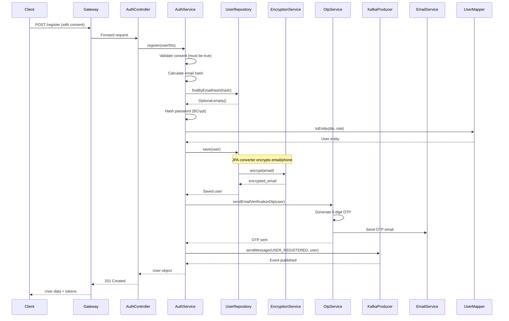
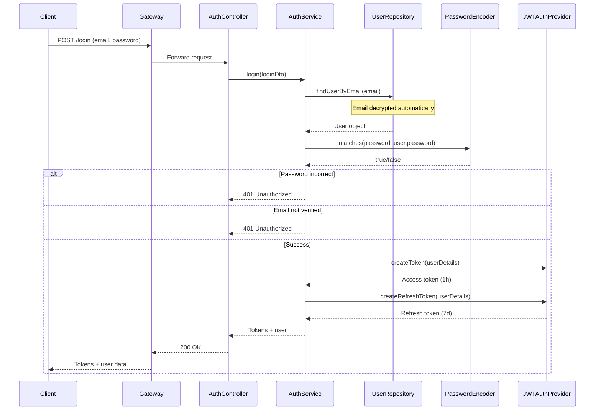

# AuthService - Complete Documentation

## Table of Contents
1. [Overview](#overview)
2. [Architecture](#architecture)
3. [API Endpoints](#api-endpoints)
4. [Authentication Flow](#authentication-flow)
5. [JWT Token System](#jwt-token-system)
6. [User Management](#user-management)
7. [GDPR Features](#gdpr-features)
8. [Kafka Integration](#kafka-integration)
9. [Security Implementation](#security-implementation)
10. [Configuration](#configuration)

---

## Overview

**AuthService** is responsible for:
- User authentication and authorization
- JWT token generation and validation
- User registration with GDPR consent
- Email verification via OTP
- Password management
- User data encryption
- User synchronization with DiagnoCareService

**Technology Stack**:
- Spring Boot 3.3.9
- Spring Security 6.x
- Spring Data JPA
- PostgreSQL
- Apache Kafka
- JWT (JSON Web Tokens)
- BCrypt password hashing
- AES-256-GCM encryption

**Port**: 8081  
**Context Path**: `/api/v1/auth`  
**Database**: `auth_db` (PostgreSQL)

---

## Architecture

### Package Structure

```
com.homosapiens.authservice/
├── AuthServiceApplication.java          # Main application class
├── controller/
│   ├── AuthController.java             # REST endpoints
│   └── RoleController.java              # Role management
├── service/
│   ├── AuthService.java                 # Core business logic
│   ├── OtpService.java                  # OTP generation/validation
│   └── helpers/
│       └── ValidationHelper.java        # Validation utilities
├── model/
│   ├── User.java                        # User entity
│   ├── Role.java                        # Role entity
│   ├── Otp.java                         # OTP entity
│   ├── dtos/                            # Data Transfer Objects
│   │   ├── UserRegisterDto.java
│   │   ├── UserLoginDto.java
│   │   ├── UserUpdateDto.java
│   │   ├── RefreshTokenRequest.java
│   │   ├── OtpSendRequest.java
│   │   ├── OtpValidateRequest.java
│   │   └── UserSyncEventDTO.java
│   ├── enums/
│   │   └── RoleEnum.java                 # PATIENT, ADMIN, DOCTOR, etc.
│   └── mapper/
│       └── UserMapper.java              # DTO to Entity mapping
├── repository/
│   ├── UserRepository.java              # User data access
│   ├── RoleRepository.java              # Role data access
│   └── OtpRepository.java               # OTP data access
├── core/
│   ├── webConfig/
│   │   ├── SecurityConfig.java          # Spring Security configuration
│   │   ├── JWTAuthProvider.java         # JWT token generation/validation
│   │   ├── PasswordConfig.java          # Password encoder
│   │   └── CustomUserDetail/
│   │       └── CustomUserDetailsService.java
│   ├── kafka/
│   │   ├── KafkaProducer.java           # Kafka event publisher
│   │   └── eventEnums/
│   │       └── KafkaEvent.java          # Event types
│   ├── security/
│   │   ├── DataEncryptionService.java   # AES-256-GCM encryption
│   │   └── EncryptedStringConverter.java # JPA encryption converter
│   ├── exception/
│   │   ├── AppException.java            # Custom exception
│   │   ├── GlobalExceptionHandler.java  # Exception handling
│   │   └── entity/
│   │       └── CustomResponseEntity.java # Standardized response
│   ├── locale/
│   │   └── LanguageUtil.java            # Internationalization
│   ├── swagger/
│   │   └── OpenApiConfig.java          # Swagger/OpenAPI config
│   └── response/
│       └── ResponseWrapperAdvice.java   # Response wrapper
└── database/
    └── seeders/
        └── RoleSeeder.java              # Initial role seeding
```

---

## API Endpoints

### Base URL
```
http://localhost:8765/api/v1/auth
```
(Through Gateway) or
```
http://localhost:8081/api/v1/auth
```
(Direct access)

### Authentication Endpoints

#### 1. POST `/register`
**Purpose**: Register a new user account

**Request Body**:
```json
{
  "email": "user@example.com",
  "firstName": "John",
  "lastName": "Doe",
  "phoneNumber": "+1234567890",
  "password": "SecurePassword123",
  "lang": "en",
  "roleId": 1,
  "privacyPolicyAccepted": true,
  "termsAccepted": true
}
```

**Validation**:
- Email: Valid email format, unique
- First name: 2-50 characters
- Last name: 2-50 characters
- Phone: Valid format (7-15 digits)
- Password: Minimum 8 characters
- Consent: Both `privacyPolicyAccepted` and `termsAccepted` must be `true`

**Response**: `201 Created`
```json
{
  "message": "Success",
  "statusCode": 201,
  "data": {
    "id": 1,
    "email": "user@example.com",
    "firstName": "John",
    "lastName": "Doe",
    "emailVerified": false,
    "privacyPolicyAccepted": true,
    "termsAccepted": true,
    "consentDate": "2024-03-16T10:00:00Z",
    "consentVersion": "v1.0-2024",
    "roles": [...]
  }
}
```

**Process**:
1. Validate consent acceptance
2. Check email uniqueness (via email hash)
3. Hash password with BCrypt
4. Encrypt email and phone number
5. Calculate email hash for uniqueness
6. Save user to database
7. Generate and send OTP email
8. Publish USER_REGISTERED event to Kafka
9. Return user data

#### 2. POST `/login`
**Purpose**: Authenticate user and get JWT tokens

**Request Body**:
```json
{
  "email": "user@example.com",
  "password": "SecurePassword123"
}
```

**Response**: `200 OK`
```json
{
  "token": "eyJhbGciOiJIUzI1NiIsInR5cCI6IkpXVCJ9...",
  "tokenValidity": 3600000,
  "refreshToken": "eyJhbGciOiJIUzI1NiIsInR5cCI6IkpXVCJ9...",
  "refreshTokenValidity": 604800000,
  "user": {...}
}
```

**Validation**:
- Email must exist
- Password must match
- Email must be verified

**Process**:
1. Find user by email (decrypts automatically)
2. Verify password with BCrypt
3. Check email verification status
4. Generate JWT access token (1 hour)
5. Generate JWT refresh token (7 days)
6. Return tokens and user data

#### 3. POST `/refresh-token`
**Purpose**: Get new access token using refresh token

**Request Body**:
```json
{
  "refreshToken": "eyJhbGciOiJIUzI1NiIsInR5cCI6IkpXVCJ9..."
}
```

**Response**: `200 OK` (same as login response)

**Process**:
1. Validate refresh token
2. Extract user email from token
3. Find user in database
4. Generate new access + refresh tokens
5. Return tokens

#### 4. POST `/validate-token`
**Purpose**: Validate JWT access token

**Headers**:
```
Authorization: Bearer <token>
```

**Response**: `200 OK`
```json
{
  "email": "user@example.com",
  "id": 1,
  "roles": [...],
  "lang": "en"
}
```

**Process**:
1. Extract token from Authorization header
2. Validate token signature and expiration
3. Return user details from token

### User Management Endpoints

#### 5. PUT `/users/{id}`
**Purpose**: Update user profile

**Request Body**:
```json
{
  "email": "newemail@example.com",
  "firstName": "Jane",
  "lastName": "Smith",
  "phoneNumber": "+9876543210",
  "lang": "fr",
  "password": "NewPassword123"
}
```

**Response**: `200 OK` (updated user)

**Process**:
1. Find user by ID
2. Validate email uniqueness if changed
3. Update fields (encrypt if needed)
4. Re-send OTP if email changed
5. Publish USER_UPDATE event to Kafka
6. Return updated user

#### 6. DELETE `/users/{id}`
**Purpose**: Delete user account

**Response**: `204 No Content`

**Process**:
1. Find user by ID
2. Delete user from database (hard delete)
3. Publish USER_DELETED event to Kafka
4. DiagnoCareService receives event and anonymizes user data

### OTP Endpoints

#### 7. POST `/otp/send`
**Purpose**: Send email verification OTP

**Request Body**:
```json
{
  "email": "user@example.com"
}
```

**Response**: `200 OK`
```json
{
  "message": "OTP sent",
  "statusCode": 200
}
```

**Process**:
1. Find user by email
2. Generate 6-digit OTP
3. Store OTP with 10-minute expiration
4. Send OTP via email
5. Return success message

#### 8. POST `/otp/validate`
**Purpose**: Validate OTP and verify email

**Request Body**:
```json
{
  "email": "user@example.com",
  "code": "123456"
}
```

**Response**: `200 OK`
```json
{
  "message": "OTP validated",
  "statusCode": 200
}
```

**Process**:
1. Find OTP by email and code
2. Check expiration
3. Mark OTP as used
4. Set `emailVerified = true` on user
5. Return success

---

## Authentication Flow

### Registration Flow



### Login Flow



---

## JWT Token System

### Token Structure

#### Access Token
- **Algorithm**: HS256 (HMAC SHA-256)
- **Expiration**: 1 hour (3600000 ms)
- **Secret Key**: `security.jwt.token.secret-key`
- **Claims**:
  - `email`: User email
  - `id`: User ID
  - `roles`: User roles array
  - `lang`: Language preference
  - `exp`: Expiration timestamp
  - `iat`: Issued at timestamp

#### Refresh Token
- **Algorithm**: HS256
- **Expiration**: 7 days (604800000 ms)
- **Secret Key**: `security.jwt.token.refresh-secret-key`
- **Claims**: Same as access token

### Token Generation

```java
// Access Token
Map<String, Object> claims = new HashMap<>();
claims.put("email", userDetails.getEmail());
claims.put("id", userDetails.getId());
claims.put("roles", userDetails.getRoles());
claims.put("lang", userDetails.getLang());

String token = Jwts.builder()
    .setClaims(claims)
    .setSubject(userDetails.getEmail())
    .setIssuedAt(new Date())
    .setExpiration(new Date(System.currentTimeMillis() + expiration))
    .signWith(SignatureAlgorithm.HS256, secretKey)
    .compact();
```

### Token Validation

1. Extract token from `Authorization: Bearer <token>` header
2. Parse and validate signature
3. Check expiration
4. Extract user details from claims
5. Return `Authentication` object

---

## User Management

### User Entity Fields

**Personal Information** (Encrypted):
- `email`: Encrypted with AES-256-GCM
- `phoneNumber`: Encrypted with AES-256-GCM
- `emailHash`: SHA-256 hash for uniqueness checks

**Profile Information**:
- `firstName`: Plain text
- `lastName`: Plain text
- `lang`: Language preference (fr/en)

**Authentication**:
- `password`: BCrypt hashed
- `emailVerified`: Boolean flag

**GDPR Consent**:
- `privacyPolicyAccepted`: Boolean (required)
- `termsAccepted`: Boolean (required)
- `consentDate`: Timestamp
- `consentVersion`: String (e.g., "v1.0-2024")

### User Lifecycle

1. **Registration**:
   - User provides consent
   - Account created with `emailVerified = false`
   - OTP sent to email
   - USER_REGISTERED event published

2. **Email Verification**:
   - User receives OTP
   - User submits OTP
   - `emailVerified = true`
   - User can now login

3. **Login**:
   - User provides credentials
   - Tokens generated
   - User can access protected resources

4. **Update**:
   - User updates profile
   - If email changed, re-verification required
   - USER_UPDATE event published

5. **Deletion**:
   - User account deleted (hard delete)
   - USER_DELETED event published
   - DiagnoCareService anonymizes user data

---

## GDPR Features

### 1. Consent Management

**Implementation**:
- Consent fields in User entity
- Validation in registration endpoint
- Consent version tracking
- Consent date recording

**Fields**:
```java
@Column(name = "privacy_policy_accepted", nullable = false)
private Boolean privacyPolicyAccepted = false;

@Column(name = "terms_accepted", nullable = false)
private Boolean termsAccepted = false;

@Column(name = "consent_date")
private Date consentDate;

@Column(name = "consent_version", length = 50)
private String consentVersion;
```

**Validation**:
```java
if (user.getPrivacyPolicyAccepted() == null || !user.getPrivacyPolicyAccepted()) {
    throw new AppException(HttpStatus.BAD_REQUEST, "Privacy policy acceptance is required");
}
if (user.getTermsAccepted() == null || !user.getTermsAccepted()) {
    throw new AppException(HttpStatus.BAD_REQUEST, "Terms of service acceptance is required");
}
```

### 2. Data Encryption

**Encrypted Fields**:
- Email (AES-256-GCM)
- Phone number (AES-256-GCM)

**Implementation**:
- `EncryptedStringConverter`: JPA AttributeConverter
- Automatic encryption on save
- Automatic decryption on read
- Backward compatible with plain text data

**Email Uniqueness**:
- `emailHash`: SHA-256 hash of email
- Used for uniqueness checks (since encrypted email varies)
- Calculated in `@PrePersist` lifecycle callback

### 3. Data Export

**Note**: Data export is implemented in DiagnoCareService, but AuthService data can be exported via:
- User profile endpoint
- Direct database query (for admin)

---

## Kafka Integration

### Events Published

#### 1. USER_REGISTERED
**Trigger**: User registration  
**Topic**: `USER_REGISTERED`  
**Payload**:
```json
{
  "id": 1,
  "email": "user@example.com",
  "firstName": "John",
  "lastName": "Doe",
  "phoneNumber": "+1234567890",
  "lang": "en",
  "active": true
}
```

**Consumer**: DiagnoCareService (UserSyncConsumer)

#### 2. USER_UPDATE
**Trigger**: User profile update  
**Topic**: `USER_UPDATE`  
**Payload**: Same as USER_REGISTERED

**Consumer**: DiagnoCareService (UserSyncConsumer)

#### 3. USER_DELETED
**Trigger**: User account deletion  
**Topic**: `USER_DELETED`  
**Payload**: Same as USER_REGISTERED (with `active: false`)

**Consumer**: DiagnoCareService (UserSyncConsumer) → Anonymizes user data

### Kafka Producer Implementation

```java
@Service
public class KafkaProducer {
    private final KafkaTemplate<String, String> kafkaTemplate;
    
    public void sendMessage(String topic, String key, Object payload) {
        String jsonPayload = objectMapper.writeValueAsString(payload);
        kafkaTemplate.send(topic, key, jsonPayload);
    }
}
```

**Configuration**:
- Bootstrap servers: `spring.kafka.bootstrap-servers`
- Key serializer: String
- Value serializer: String (JSON)

---

## Security Implementation

### Password Security

**Hashing**: BCrypt
- **Rounds**: 10 (default)
- **Salt**: Automatic (unique per password)
- **Storage**: `users.password` column

**Validation**:
```java
if (!passwordEncoder.matches(loginDto.getPassword(), user.getPassword())) {
    throw new AppException(HttpStatus.UNAUTHORIZED, "Email or password incorrect");
}
```

### Data Encryption

**Algorithm**: AES-256-GCM
- **Key Size**: 256 bits
- **IV Size**: 12 bytes (random per encryption)
- **Tag Size**: 16 bytes
- **Key Source**: Environment variable `ENCRYPTION_SECRET_KEY`

**Encryption Process**:
1. Generate random IV (12 bytes)
2. Initialize cipher with key and IV
3. Encrypt plain text
4. Combine IV + ciphertext
5. Base64 encode result
6. Store in database

**Decryption Process**:
1. Base64 decode stored value
2. Extract IV (first 12 bytes)
3. Extract ciphertext (remaining bytes)
4. Initialize cipher with key and IV
5. Decrypt to plain text

### JWT Security

**Token Storage**: Client-side (localStorage/sessionStorage)  
**Token Transmission**: `Authorization: Bearer <token>` header  
**Validation**: Gateway validates token before forwarding requests

**Token Theft Mitigation**:
- Short expiration (1 hour for access token)
- Refresh token rotation
- HTTPS in production (required)

---

## Configuration

### Application Properties

```properties
# Server
server.port=8081
spring.application.name=Auth-Service
server.servlet.contextPath=/api/v1/auth/

# Database
spring.datasource.url=jdbc:postgresql://localhost:5432/auth_db
spring.datasource.username=${DB_USERNAME:postgres}
spring.datasource.password=${DB_PASSWORD:postgres}

# JPA
spring.jpa.hibernate.ddl-auto=update
spring.jpa.show-sql=true

# JWT
security.jwt.token.secret-key=${SECRET_KEY:dev-secret-key}
security.jwt.token.refresh-secret-key=${REFRESH_SECRET_KEY:dev-refresh-secret-key}
security.jwt.token.expiration=${TOKEN_EXPIRATION_TIME:3600000}
security.jwt.token.refresh-expiration=${REFRESH_TOKEN_EXPIRATION_TIME:604800000}

# Kafka
spring.kafka.bootstrap-servers=${KAFKA_BOOTSTRAP_SERVERS:localhost:29092}

# Mail (SMTP)
spring.mail.host=${SMTP_HOST:}
spring.mail.port=${SMTP_PORT:587}
spring.mail.username=${SMTP_USERNAME}
spring.mail.password=${SMTP_PASSWORD}
app.mail.from=${SMTP_USERNAME:no-reply@diagnocare.com}

# OTP
app.otp.length=6
app.otp.expiration-minutes=10

# GDPR
app.consent.version=${CONSENT_VERSION:v1.0-2024}
encryption.secret-key=${ENCRYPTION_SECRET_KEY:}

# Eureka
eureka.client.serviceUrl.defaultZone=http://localhost:8761/eureka/
```

### Environment Variables

**Required**:
- `ENCRYPTION_SECRET_KEY`: 256-bit base64 encoded key
- `SECRET_KEY`: JWT access token secret
- `REFRESH_SECRET_KEY`: JWT refresh token secret
- `SMTP_USERNAME`: Email username
- `SMTP_PASSWORD`: Email password

**Optional**:
- `CONSENT_VERSION`: Consent version (default: v1.0-2024)
- `TOKEN_EXPIRATION_TIME`: Access token expiration (ms)
- `REFRESH_TOKEN_EXPIRATION_TIME`: Refresh token expiration (ms)

### Key Generation

**Encryption Key**:
```bash
openssl rand -base64 32
```

**JWT Secret Keys**:
```bash
openssl rand -base64 64
```

---

## Error Handling

### Exception Types

1. **AppException**: Custom application exception
   - HTTP status code
   - Error message
   - Localized messages

2. **ConstraintViolationException**: Validation errors
   - Handled by GlobalExceptionHandler
   - Returns 400 Bad Request

3. **AuthenticationException**: Authentication failures
   - Returns 401 Unauthorized

### Error Response Format

```json
{
  "message": "Error message",
  "statusCode": 400,
  "data": null
}
```

---

## Testing

### Unit Tests
- `AuthServiceTest`: Service layer tests
- Mock repositories and dependencies
- Test all business logic

### Integration Tests
- `AuthControllerIntegrationTest`: Full HTTP tests
- Uses H2 in-memory database
- Tests complete request/response cycle

### Test Configuration
- H2 database for tests
- Mock Kafka producer
- Mock mail sender
- Test encryption keys

---

## Next Steps

See:
- [DiagnoCare Service](04-diagnocare-service.md)
- [Gateway Service](05-gateway-service.md)
- [API Endpoints](07-api-endpoints.md)
- [Workflows](08-workflows.md)
