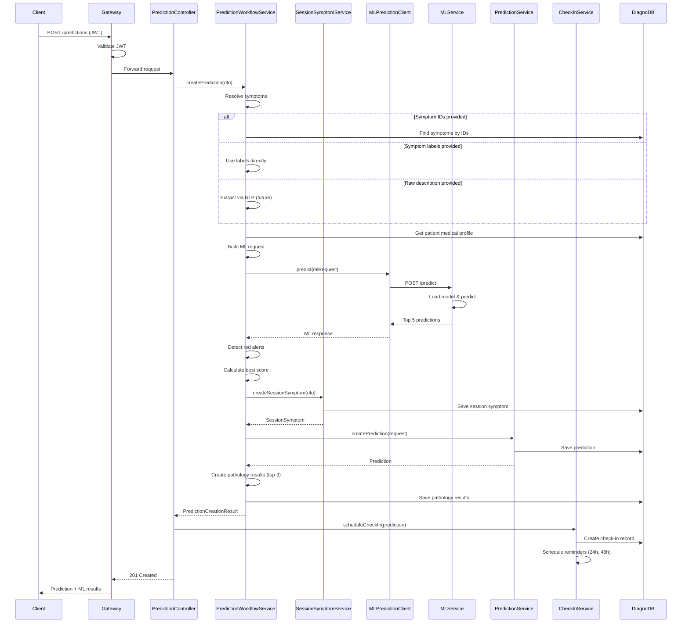

# DiagnoCare Service - Complete Documentation

## Table of Contents
1. [Overview](#overview)
2. [Architecture](#architecture)
3. [Core Features](#core-features)
4. [API Endpoints](#api-endpoints)
5. [Prediction Workflow](#prediction-workflow)
6. [Check-In System](#check-in-system)
7. [GDPR Features](#gdpr-features)
8. [Kafka Integration](#kafka-integration)
9. [ML Service Integration](#ml-service-integration)
10. [Configuration](#configuration)

---

## Overview

**DiagnoCareService** is the core business service responsible for:
- Symptom management and analysis
- ML-based disease prediction
- Patient medical profiles
- Check-in reminders and follow-ups
- Medical reports
- User data export and anonymization
- User synchronization from AuthService

**Technology Stack**:
- Spring Boot 3.3.9
- Spring Data JPA / Hibernate
- PostgreSQL
- Apache Kafka
- AES-256-GCM encryption
- HTTP client for ML service

**Port**: 8080  
**Context Path**: `/api/v1/diagnocare`  
**Database**: `diagnocare_db` (PostgreSQL)

---

## Architecture

### Package Structure

```
com.homosapiens.diagnocareservice/
├── DiagnoCareServiceApplication.java
├── controller/                          # REST controllers
│   ├── PredictionController.java
│   ├── SymptomController.java
│   ├── CheckInController.java
│   ├── UserController.java
│   ├── ReportController.java
│   ├── PatientMedicalProfileController.java
│   └── ...
├── service/                             # Business logic
│   ├── PredictionService.java
│   ├── PredictionWorkflowService.java
│   ├── SessionSymptomService.java
│   ├── SymptomService.java
│   ├── CheckInService.java
│   ├── CheckInEmailService.java
│   ├── UserService.java
│   ├── UserDataExportService.java
│   ├── UserDataAnonymizationService.java
│   ├── MLPredictionClient.java
│   └── ...
├── model/
│   ├── entity/                          # JPA entities
│   │   ├── User.java
│   │   ├── Prediction.java
│   │   ├── SessionSymptom.java
│   │   ├── Symptom.java
│   │   ├── CheckIn.java
│   │   ├── PathologyResult.java
│   │   └── ...
│   └── mongodb/                         # MongoDB entities (if used)
├── repository/                          # Data access
│   ├── UserRepository.java
│   ├── PredictionRepository.java
│   ├── SessionSymptomRepository.java
│   └── ...
├── dto/                                 # Data Transfer Objects
│   ├── PredictionDTO.java
│   ├── SessionSymptomRequestDTO.java
│   ├── MLPredictionRequestDTO.java
│   ├── MLPredictionResponseDTO.java
│   └── ...
├── core/
│   ├── config/
│   │   ├── MLServiceConfig.java
│   │   └── CheckInScheduler.java
│   ├── kafka/
│   │   ├── KafkaProducer.java
│   │   └── UserSyncConsumer.java
│   ├── security/
│   │   ├── DataEncryptionService.java
│   │   ├── EncryptedStringConverter.java
│   │   └── EncryptedFloatConverter.java
│   └── exception/
│       └── GlobalExceptionHandler.java
└── config/
    ├── CheckInScheduler.java            # Scheduled tasks
    └── UrgentDiseaseSeeder.java        # Data seeding
```

---

## Core Features

### 1. Symptom Management
- Create, update, delete symptoms
- Search symptoms by label
- Symptom catalog management

### 2. Disease Prediction
- ML-based prediction from symptoms
- Patient profile integration
- Red alert detection
- Top 5 disease predictions
- Specialist recommendations

### 3. Check-In System
- Automatic check-in scheduling after prediction
- Email reminders (24h and 48h)
- Follow-up prediction creation
- Outcome tracking (improved/same/worse)

### 4. Medical Data Management
- Patient medical profiles
- Medical reports
- Session symptoms tracking
- Prediction history

### 5. GDPR Compliance
- Data export (all user data)
- Data anonymization (on deletion)
- Encryption at rest

---

## API Endpoints

### Base URL
```
http://localhost:8765/api/v1/diagnocare
```
(Through Gateway with JWT authentication)

### Prediction Endpoints

#### POST `/predictions`
**Purpose**: Create a new disease prediction

**Request Body**:
```json
{
  "userId": 1,
  "rawDescription": "I have fever, cough, and fatigue",
  "symptomIds": [1, 2, 3],
  "symptomLabels": ["fever", "cough", "fatigue"]
}
```

**Response**: `201 Created`
```json
{
  "prediction": {
    "id": 1,
    "bestScore": 85.5,
    "isRedAlert": false,
    "comment": "AI prediction based on symptoms",
    "sessionSymptomId": 1
  },
  "mlResults": {
    "predictions": [
      {
        "rank": 1,
        "disease": "Fungal infection",
        "probability": 45.23,
        "specialist": "Dermatologist"
      }
    ]
  }
}
```

**Process**:
1. Extract/resolve symptoms
2. Get patient medical profile
3. Call ML service
4. Detect red alerts
5. Save prediction and pathology results
6. Schedule check-in

#### GET `/predictions/{id}`
**Purpose**: Get prediction by ID

#### PUT `/predictions/{id}`
**Purpose**: Update prediction

#### DELETE `/predictions/{id}`
**Purpose**: Delete prediction

#### GET `/predictions/user/{userId}`
**Purpose**: Get all predictions for a user

#### GET `/predictions/red-alerts`
**Purpose**: Get all red alert predictions

### Symptom Endpoints

#### POST `/symptoms`
**Purpose**: Create symptom

#### GET `/symptoms`
**Purpose**: List all symptoms

#### GET `/symptoms/{id}`
**Purpose**: Get symptom by ID

#### PUT `/symptoms/{id}`
**Purpose**: Update symptom

#### DELETE `/symptoms/{id}`
**Purpose**: Delete symptom

#### GET `/symptoms/search?label={query}`
**Purpose**: Search symptoms by label

### Check-In Endpoints

#### POST `/check-ins`
**Purpose**: Submit check-in and create follow-up prediction

**Request Body**:
```json
{
  "userId": 1,
  "previousPredictionId": 1,
  "symptomIds": [1, 2],
  "symptomLabels": ["fever", "cough"]
}
```

**Response**: `201 Created`
```json
{
  "id": 1,
  "status": "COMPLETED",
  "outcome": "IMPROVED",
  "previousPrediction": {...},
  "newPrediction": {...}
}
```

#### GET `/check-ins?userId={userId}`
**Purpose**: Get all check-ins for a user

### User Endpoints

#### GET `/users/{id}`
**Purpose**: Get user by ID

#### PUT `/users/{id}`
**Purpose**: Update user

#### DELETE `/users/{id}`
**Purpose**: Delete user (triggers anonymization)

#### GET `/users/{id}/export`
**Purpose**: Export all user data (GDPR)

**Response**: `200 OK`
```json
{
  "userId": 1,
  "email": "user@example.com",
  "firstName": "John",
  "lastName": "Doe",
  "medicalProfile": {...},
  "sessionSymptoms": [...],
  "predictions": [...],
  "checkIns": [...],
  "reports": [...],
  "exportDate": "2024-03-16T10:00:00Z",
  "exportVersion": "v1.0"
}
```

### Medical Profile Endpoints

#### GET `/medical-profiles/user/{userId}`
**Purpose**: Get patient medical profile

#### POST `/medical-profiles`
**Purpose**: Create/update medical profile

### Report Endpoints

#### GET `/reports/user/{userId}`
**Purpose**: Get all reports for a user

#### POST `/reports`
**Purpose**: Create report

---

## Prediction Workflow

### Complete Flow



### Step-by-Step Process

1. **Symptom Resolution**:
   - If `symptomIds` provided → Fetch from database
   - If `symptomLabels` provided → Use directly
   - If `rawDescription` provided → Extract via NLP (future)

2. **Profile Retrieval**:
   - Get patient medical profile (age, weight, BP, cholesterol, etc.)
   - If no profile → Use default values

3. **ML Request Building**:
   - Convert symptoms to list
   - Map profile data to ML format
   - Set language preference

4. **ML Service Call**:
   - HTTP POST to ML service `/predict`
   - Timeout: 30 seconds
   - Error handling with fallback

5. **Result Processing**:
   - Detect red alerts (urgent diseases)
   - Calculate best score (top prediction probability)
   - Create pathology results (top 3)

6. **Persistence**:
   - Save session symptom
   - Save prediction
   - Save pathology results (with pathology & doctor entities)

7. **Check-In Scheduling**:
   - Create check-in record
   - Calculate reminder times (24h, 48h)
   - Schedule email reminders

---

## Check-In System

### Overview

Check-ins are follow-up reminders sent to users after a prediction to track their health status.

### Check-In Lifecycle

1. **Scheduling** (Automatic):
   - Triggered after prediction creation
   - Status: `PENDING`
   - Reminder times calculated:
     - First: 24 hours (1440 minutes)
     - Second: 48 hours (2880 minutes)

2. **Reminder Sending** (Scheduled):
   - `CheckInScheduler` runs every 15 minutes
   - Checks for due reminders
   - Sends email with check-in link
   - Updates status: `SENT_24H` or `SENT_48H`

3. **Check-In Submission** (User):
   - User clicks link in email
   - Submits current symptoms
   - Creates follow-up prediction
   - Compares with previous prediction
   - Determines outcome: `IMPROVED`, `SAME`, `WORSE`
   - Status: `COMPLETED`

### Check-In Scheduler

```java
@Scheduled(fixedDelayString = "${app.checkin.scheduler-delay-ms:900000}")
public void sendCheckInReminders() {
    List<CheckIn> due = checkInRepository.findDueReminders(LocalDateTime.now());
    for (CheckIn checkIn : due) {
        if (checkIn.getFirstSentAt() == null && 
            checkIn.getFirstReminderAt() != null &&
            !LocalDateTime.now().isBefore(checkIn.getFirstReminderAt())) {
            // Send first reminder
            checkInEmailService.sendCheckInReminder(checkIn, false);
            checkIn.setFirstSentAt(LocalDateTime.now());
            checkIn.setStatus(CheckInStatus.SENT_24H);
        } else if (checkIn.getSecondSentAt() == null && 
                   checkIn.getSecondReminderAt() != null &&
                   !LocalDateTime.now().isBefore(checkIn.getSecondReminderAt())) {
            // Send second reminder
            checkInEmailService.sendCheckInReminder(checkIn, true);
            checkIn.setSecondSentAt(LocalDateTime.now());
            checkIn.setStatus(CheckInStatus.SENT_48H);
        }
        checkInRepository.save(checkIn);
    }
}
```

### Outcome Determination

```java
private CheckInOutcome determineOutcome(Prediction previous, Prediction newPrediction) {
    BigDecimal previousScore = previous.getBestScore();
    BigDecimal newScore = newPrediction.getBestScore();
    
    if (newScore.compareTo(previousScore) < 0) {
        return CheckInOutcome.IMPROVED;  // Lower score = better
    } else if (newScore.compareTo(previousScore) > 0) {
        return CheckInOutcome.WORSE;     // Higher score = worse
    } else {
        return CheckInOutcome.SAME;
    }
}
```

---

## GDPR Features

### 1. Data Export

**Endpoint**: `GET /users/{id}/export`

**Service**: `UserDataExportService`

**Exports**:
- User profile (encrypted fields decrypted)
- Medical profile
- All session symptoms
- All predictions
- All check-ins
- All reports

**Format**: JSON

**Response**:
```json
{
  "userId": 1,
  "email": "user@example.com",
  "firstName": "John",
  "lastName": "Doe",
  "medicalProfile": {...},
  "sessionSymptoms": [...],
  "predictions": [...],
  "checkIns": [...],
  "reports": [...],
  "exportDate": "2024-03-16T10:00:00Z",
  "exportVersion": "v1.0"
}
```

### 2. Data Anonymization

**Trigger**: `USER_DELETED` Kafka event

**Service**: `UserDataAnonymizationService`

**Process**:
1. Receive `USER_DELETED` event
2. Find user by ID
3. Anonymize PII:
   - Email → `deleted_{uuid}@anonymized.local`
   - First name → `ANONYMOUS_USER`
   - Last name → `ANONYMOUS_USER`
   - Phone → `null`
   - Address → `null`
4. Set `isActive = false`
5. **Preserve health data**:
   - Predictions
   - Session symptoms
   - Check-ins
   - Reports
   - Medical profile

**Purpose**: GDPR right to erasure while preserving anonymized health data for research.

---

## Kafka Integration

### Consumer: UserSyncConsumer

**Topics**: `USER_REGISTERED`, `USER_UPDATE`, `USER_DELETED`

**Group ID**: `diagnocare-user-sync`

**Process**:

#### USER_REGISTERED / USER_UPDATE
1. Parse event payload
2. Find user by ID (or email if not found)
3. Create or update user in DiagnoCare database
4. Sync fields: email, firstName, lastName, phoneNumber, lang, isActive

#### USER_DELETED
1. Parse event payload
2. Call `UserDataAnonymizationService.anonymizeUserData(userId)`
3. Anonymize user PII
4. Preserve health data

**Error Handling**:
- Logs errors but doesn't throw exceptions
- Prevents Kafka consumer from crashing
- Retries via Kafka consumer configuration

---

## ML Service Integration

### MLPredictionClient

**Service URL**: `http://ml-prediction-service:5000`  
**Configurable**: `ml.service.url` property

### Endpoints

#### POST `/predict`
**Request**:
```json
{
  "symptoms": ["fever", "cough", "fatigue"],
  "age": 45,
  "weight": 75.0,
  "height": 170.0,
  "tension_moyenne": 120.0,
  "cholesterole_moyen": 190.0,
  "gender": "Male",
  "blood_pressure": "Normal",
  "cholesterol_level": "Normal",
  "smoking": "No",
  "alcohol": "None",
  "sedentarite": "Moderate",
  "family_history": "No",
  "language": "en"
}
```

**Response**:
```json
{
  "predictions": [
    {
      "rank": 1,
      "disease": "Fungal infection",
      "disease_fr": "Infection fongique",
      "probability": 45.23,
      "specialist": "Dermatologist",
      "specialist_fr": "Dermatologue",
      "specialist_probability": 42.15,
      "description": "..."
    }
  ],
  "metadata": {
    "symptoms_count": 3,
    "profile_used": true
  }
}
```

### Error Handling

- **Timeout**: 30 seconds
- **Connection Error**: Returns error response
- **Invalid Response**: Logs error, throws exception

---

## Configuration

### Application Properties

```properties
# Server
server.port=8080
spring.application.name=DiagnoCare-Service

# Database
spring.datasource.url=jdbc:postgresql://localhost:5432/diagnocare_db
spring.datasource.username=${DB_USERNAME:postgres}
spring.datasource.password=${DB_PASSWORD:postgres}

# JPA
spring.jpa.hibernate.ddl-auto=update
spring.jpa.show-sql=false

# Kafka
spring.kafka.bootstrap-servers=${KAFKA_BOOTSTRAP_SERVERS:localhost:29092}
spring.kafka.consumer.group-id=diagnocare-user-sync

# ML Service
ml.service.url=${ML_SERVICE_URL:http://ml-prediction-service:5000}

# Check-In
app.checkin.scheduler-delay-ms=${CHECKIN_SCHEDULER_DELAY_MS:900000}
app.checkin.first-reminder-minutes=${CHECKIN_FIRST_REMINDER_MINUTES:1440}
app.checkin.second-reminder-minutes=${CHECKIN_SECOND_REMINDER_MINUTES:2880}
app.checkin.base-url=${CHECKIN_BASE_URL:http://localhost:3000/check-in}

# Encryption
encryption.secret-key=${ENCRYPTION_SECRET_KEY:}

# Eureka
eureka.client.serviceUrl.defaultZone=http://localhost:8761/eureka/
```

### Environment Variables

**Required**:
- `ENCRYPTION_SECRET_KEY`: AES-256-GCM encryption key
- `ML_SERVICE_URL`: ML service URL (default: http://ml-prediction-service:5000)

**Optional**:
- `CHECKIN_SCHEDULER_DELAY_MS`: Scheduler interval (default: 15 minutes)
- `CHECKIN_FIRST_REMINDER_MINUTES`: First reminder delay (default: 24h)
- `CHECKIN_SECOND_REMINDER_MINUTES`: Second reminder delay (default: 48h)
- `CHECKIN_BASE_URL`: Frontend check-in page URL

---

## Next Steps

See:
- [API Endpoints](07-api-endpoints.md)
- [Workflows](08-workflows.md)
- [Kafka Events](09-kafka-events.md)
- [GDPR Implementation](10-gdpr-implementation.md)
