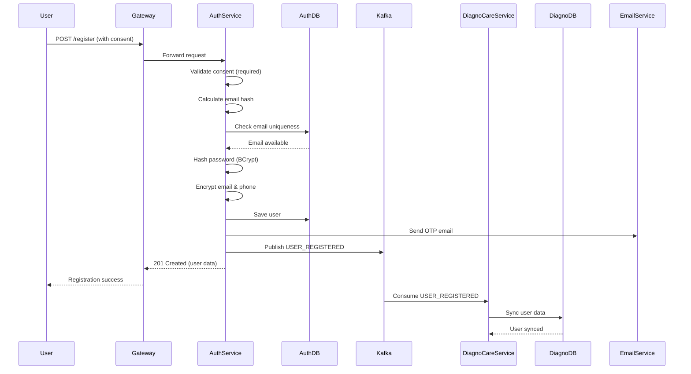
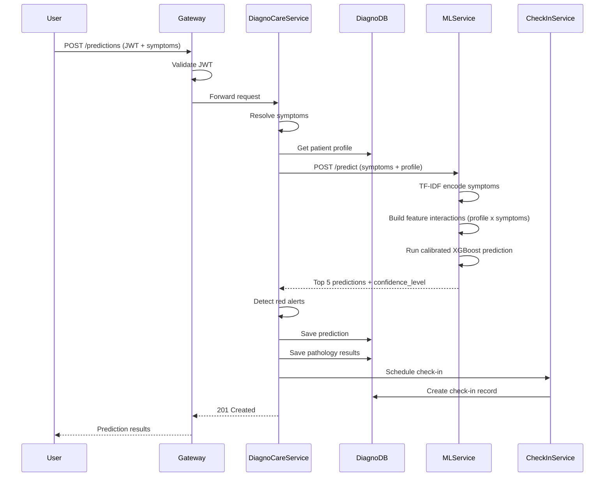
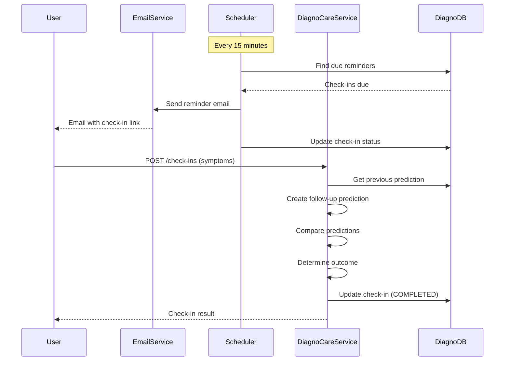
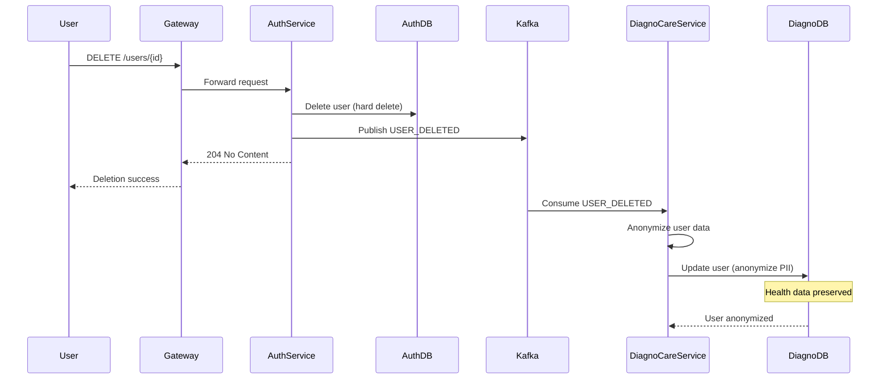
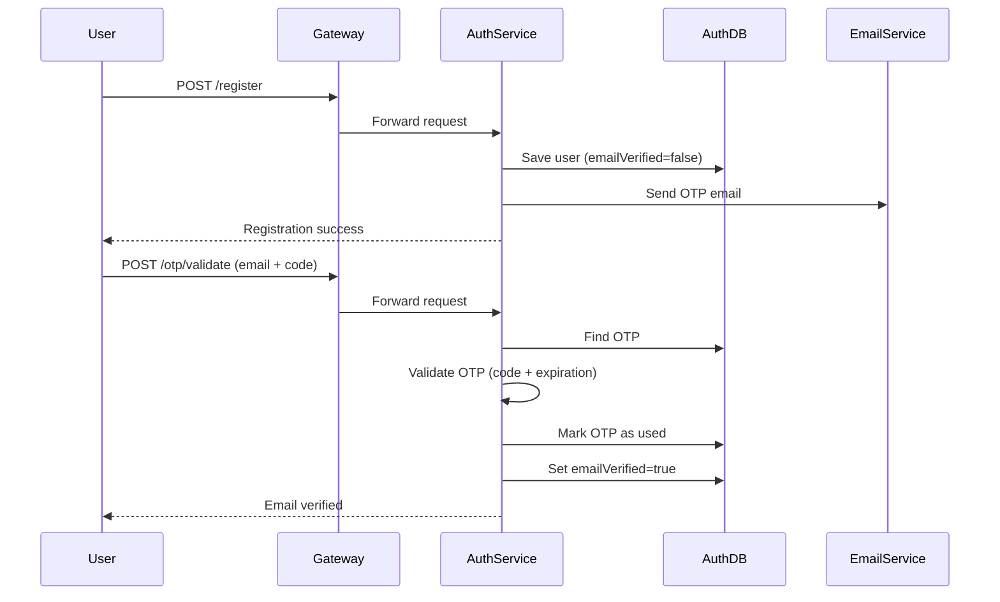

# Business Workflows - Complete Documentation

## Table of Contents
1. [User Registration Workflow](#user-registration-workflow)
2. [Prediction Workflow](#prediction-workflow)
3. [Check-In Workflow](#check-in-workflow)
4. [User Deletion/Anonymization Workflow](#user-deletionsanonymization-workflow)
5. [Email Verification Workflow](#email-verification-workflow)

---

## User Registration Workflow

### Flow Diagram

### Steps

1. **User submits registration** with consent acceptance
2. **Validate consent** (both privacy policy and terms must be accepted)
3. **Check email uniqueness** using email hash
4. **Hash password** with BCrypt
5. **Encrypt sensitive data** (email, phone) with AES-256-GCM
6. **Save user** to AuthService database
7. **Generate and send OTP** via email
8. **Publish USER_REGISTERED event** to Kafka
9. **DiagnoCareService syncs user** to its database
10. **Return user data** to client

---

## Prediction Workflow

### Flow Diagram

### Steps

1. **User submits symptoms** via `symptomLabels` only (array of strings; no symptom IDs or raw description).
2. **Use symptom labels** directly for the ML request
3. **Get patient medical profile** (or use defaults)
4. **Build ML request** with symptoms and profile (age, gender, smoking, BP, cholesterol, etc.)
5. **Call ML service** for predictions (TF-IDF encoding, feature interactions, calibrated XGBoost)
6. **Process ML response**:
   - Check `confidence_level` (high/moderate/low) based on calibrated probability
   - Detect red alerts (urgent diseases; matching uses the English disease name from the ML response)
   - Calculate best score
   - Create pathology results (top 3)
7. **Save prediction** and results to database
8. **Schedule check-in** reminders (24h, 48h)
9. **Return prediction** with ML results

---

## Check-In Workflow

### Flow Diagram

### Steps

#### Reminder Sending (Scheduled)
1. **Scheduler runs** every 15 minutes
2. **Find due reminders** (24h or 48h past prediction)
3. **Send email** with check-in link
4. **Update status** (SENT_24H or SENT_48H)

#### Check-In Submission (User)
1. **User clicks link** in email
2. **Submits check-in** with `userId`, `previousPredictionId`, and `symptomLabels` (no symptom IDs)
3. **Get previous prediction**
4. **Create follow-up prediction** with new symptoms
5. **Compare predictions**:
   - If new score < previous → IMPROVED
   - If new score > previous → WORSE
   - If equal → SAME
6. **Update check-in** status to COMPLETED
7. **Return outcome** to user

---

## User Deletion/Anonymization Workflow

### Flow Diagram

### Steps

1. **User requests deletion** via DELETE endpoint
2. **AuthService deletes user** from auth database (hard delete)
3. **Publish USER_DELETED event** to Kafka
4. **DiagnoCareService consumes event**
5. **Anonymize user PII**:
   - Email → `deleted_{uuid}@anonymized.local`
   - Name → `ANONYMOUS_USER`
   - Phone → `null`
   - Address → `null`
   - Set `isActive = false`
6. **Preserve health data**:
   - Predictions
   - Session symptoms
   - Check-ins
   - Reports
   - Medical profile
7. **User cannot login** (isActive = false)
8. **Health data available for research** (anonymized)

---

## Email Verification Workflow

### Flow Diagram

### Steps

1. **User registers** → OTP sent automatically
2. **User receives OTP** via email (6 digits, 10 min expiration)
3. **User submits OTP** with email
4. **Validate OTP**:
   - Check code matches
   - Check not expired
   - Check not already used
5. **Mark OTP as used**
6. **Set emailVerified = true**
7. **User can now login**

---

## See Also
- [Auth Service](03-auth-service.md)
- [DiagnoCare Service](04-diagnocare-service.md)
- [Kafka Events](09-kafka-events.md)
